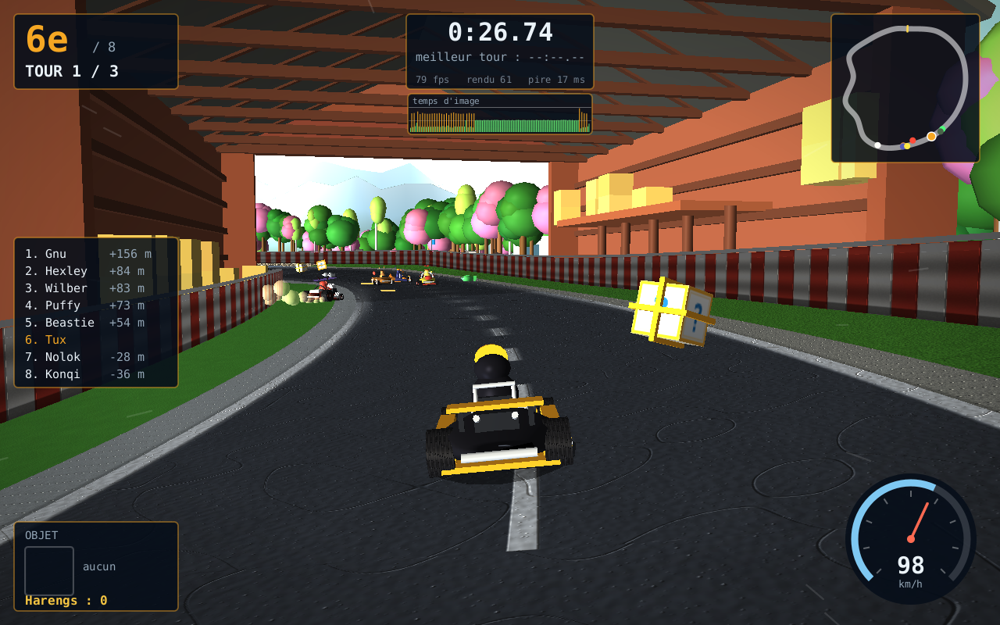

# TuxKart — Java 26 / JavaFX 26

Un clone jouable de **TuxKart**, le jeu de kart libre de Steve Baker (l'ancêtre
de SuperTuxKart), réécrit intégralement en **Java 26** avec **JavaFX 26** pour le
rendu 3D, l'interface et la boucle de jeu.

Tout est autonome : le jeu ne lit **aucun fichier de données**. Les circuits
sont générés à partir de splines, le relief vient d'un bruit de Perlin, les
textures — y compris leurs **cartes de normales** — sont calculées pixel par
pixel au démarrage, les karts et les mascottes sont assemblés à partir de
primitives et de maillages galbés, et les bruitages **comme la musique** sont
synthétisés à la volée.



---

## Installation et lancement

Prérequis : **JDK 26** (ou plus récent) et **Maven 3.6+**. Les modules JavaFX
sont téléchargés automatiquement par Maven, il n'y a rien d'autre à installer.

```bash
cd SuperTuxKart-Java

# lancer directement
./run.sh

# ou construire un jar autonome puis le lancer
mvn package
java -jar target/tuxkart.jar
```

`run.sh` couvre aussi les autres usages :

```bash
./run.sh test         # la suite de tests
./run.sh bench        # banc d'essai sans interface (voir plus bas)
./run.sh chiffres     # les nombres affirmés ci-dessous, mesurés (voir plus bas)
./run.sh regime       # relit le journal de performances, chauffe écartée (voir plus bas)
./run.sh jar          # construit le jar autonome puis le lance
./run.sh plein-ecran  # occupe tout un moniteur (voir plus bas)
```

### Plein écran, et sur quel moniteur

```bash
./run.sh plein-ecran          # l'écran du bas, par défaut
./run.sh plein-ecran haut     # ou : gauche, droite, principal, 0, 1...
export TUXKART_MONITOR=haut   # pour ne plus avoir à le préciser
```

Sur un portable surmonté d'un moniteur externe, `bas` est l'écran intégré :
le jeu l'occupe entièrement pendant qu'on garde le moniteur du haut pour
travailler. D'où ce choix par défaut.

JavaFX ne donne pas le nom des sorties vidéo (`HDMI-1`, `eDP-1`…) : il n'expose
que des rectangles dans un repère commun. Un moniteur se désigne donc par sa
position — `bas`, `haut`, `gauche`, `droite` — ou par son numéro. Ne pas
confondre avec `-Dtuxkart.screen`, qui désigne un écran *du jeu* (menu, course,
options).

Deux détails que le code note au passage, tous deux vérifiés sous Wayland :

- la **position** de la fenêtre doit être posée avant `show()`, car c'est elle
  qui détermine le moniteur retenu ; le **plein écran**, lui, doit être demandé
  après, sinon le gestionnaire de fenêtres ignore purement et simplement la
  demande et le jeu s'ouvre en fenêtre ;
- Échap ne quitte plus le plein écran. JavaFX l'interceptait avant l'écran
  courant, si bien qu'en course la touche de pause renvoyait en mode fenêtre au
  lieu de mettre en pause. **F11** reste la bascule.

### Garder un JDK plus ancien par défaut

Le JDK 26 n'a pas besoin d'être celui du système. Deux mécanismes s'en chargent,
et permettent donc de rester sur un JDK plus ancien pour d'autres projets :

- `run.sh` retient le premier JDK suffisant trouvé dans `$JAVA_HOME`, `~/.jdks`
  ou `/usr/lib/jvm`. `TUXKART_JAVA_HOME=/chemin/du/jdk26 ./run.sh` en impose un.
- les commandes `mvn` passent par un **toolchain** : Maven peut tourner sur un
  JDK plus ancien, il compilera et testera quand même avec le JDK 26 déclaré
  dans `~/.m2/toolchains.xml`. Sans cette déclaration, `mvn` échoue sur un
  `release version 26 not supported`.

Une exception : **`mvn javafx:run` exige que Maven lui-même tourne sur le JDK 26**.

```bash
JAVA_HOME=/chemin/du/jdk26 mvn javafx:run
```

La raison tient au JDK sur lequel tourne Maven, pas à celui du toolchain :
javafx-maven-plugin lit les descripteurs de modules de JavaFX dans la JVM de
Maven. Ceux de JavaFX 26 sont compilés en version de classe 68, illisible pour un
JDK 17, si bien que le plugin ne trouve aucun nom de module et émet un
`--add-modules` sans valeur — d'où l'erreur `--add-modules requires modules to be
specified`.

Trois contournements ont été essayés, sans succès : figer le classifieur de
plateforme des dépendances JavaFX (le module path reste illisible),
`runtimePathOption=CLASSPATH` (le plugin charge alors la classe principale dans
la JVM de Maven, qui refuse des classes en version 70) et
`includePathExceptionsInClasspath`. 0.0.8 étant la dernière version publiée du
plugin, il n'y a pas de correctif à attendre.

`./run.sh` n'est pas concerné : il lance le jeu lui-même, sans ce plugin.

---

## Commandes

| Touche | Action |
|---|---|
| ↑ | Accélérer |
| ↓ | Freiner, puis marche arrière |
| ← → | Tourner |
| `Ctrl` gauche ou `X` | Déraper (*skid*) |
| `Espace` | Utiliser l'objet |
| `W` | Wheelie : plus rapide, mais moins maniable |
| `J` | Sauter |
| `R` | Sauvetage (l'oiseau vous repose sur la piste) |
| `B` | Regarder derrière |
| `C` | Changer de caméra (poursuite / pare-chocs / large) |
| `M` | Afficher ou masquer la minicarte |
| `P` ou `Échap` | Pause |
| `F11` | Plein écran |
| `F12` | Capture d'écran PNG dans le dossier personnel |

---

## Ce que le jeu contient

**8 pilotes** — Tux, Gnu, Wilber, Puffy, Konqi, Hexley, Beastie et Nolok, les
mascottes libres qui accompagnent la lignée TuxKart. Chacun a ses propres
caractéristiques : vitesse de pointe, accélération, adhérence, masse et vitesse
de braquage.

**8 machines différentes**, aucune n'ayant la silhouette d'une autre : le kart
classique de Tux, le buggy à cage de Gnu, le roadster à garde-boue de Wilber, la
bulle à arceaux de Puffy, la monoplace à ailerons de Konqi, le trois-roues
d'Hexley, le hot-rod à moteur apparent de Beastie et l'engin blindé de Nolok.
Coque, roues, échappements et accastillage changent avec le châssis — et les
mascottes se distinguent tout autant : museau, oreilles, couvre-chef, sourcils,
cornes et corpulence.

**9 circuits**, et deux ne se ressemblent jamais — ni par la taille, ni par la
largeur, ni par ce qu'on y traverse :

| Circuit | Longueur | Largeur | Tours | Revêtement | Objets posés | Sauts | On y traverse |
|---|---|---|---|---|---|---|---|
| Table de billard | 925 m | 13 à 28 m | 4 | feutre | 25 | 3 | la poche de coin |
| Petit Volcan | 930 m | 10 à 12 m | 5 | terre battue | 12 | 3 | — |
| Piste de Tux | 1 070 m | 15 m | 3 | bitume | 13 | 1 | la grange |
| Donjon hanté | 1 270 m | 12 à 26 m | 3 | dalle | 46 | 4 | la nef |
| Comptoir | 1 355 m | 12 à 26 m | 3 | parquet | 57 | 4 | le tonneau géant |
| Colline du Manchot | 1 640 m | 12 m | 3 | bitume | 32 | 3 | le tunnel |
| Désert de GNU | 1 735 m | 13 à 22 m | 2 | sable damé | 26 | 3 | le temple |
| Salon | 1 900 m | 13 à 30 m | 2 | tapis | 74 | 5 | la boîte en carton |
| Banquise | 2 450 m | 19 à 25 m | 2 | neige damée | 20 | 3 | le dôme de glace |

Du plus court au plus long, il y a un facteur deux et demi ; du plus nu au plus
meublé, un facteur six. Le volcan n'a **aucun** ouvrage et douze pièces posées,
dont onze sont des repères de bord de piste : sur une coulée, ce vide *est* le
décor. La douzième est le volcan lui-même, un cône de soixante-seize mètres de
rayon planté à cent cinq mètres du ruban — parce qu'un circuit qui s'appelle
« Petit Volcan » doit en montrer un, et qu'un contrôle visuel avait relevé qu'il
n'en montrait aucun. Le salon en a soixante-quatorze, parce qu'une pièce habitée
se raconte par ses objets.

Les limites de piste changent aussi : glissière métallique sur la Piste de Tux,
congères sur la Banquise, barrières de bois sur la Colline, murs de pneus au
Volcan, talus de terre au Désert — et **rien du tout** sur les quatre circuits
d'intérieur, où l'on sort du ruban pour rouler sur la moquette.

Le revêtement décide de l'adhérence et du dessin de la piste : sur terre, sable
ou neige, pas de marquage peint ni de vibreur — la trajectoire se lit aux
ornières, plus lisses et plus sombres que le reste. Sur bitume, chaque virage
reçoit son propre style de bordure (vibreur rouge, bleu, dégagement peint) et un
virage sur trois un bac à gravier.

**Sans vibreur, c'est l'écart de clarté qui dit où finit la piste — et il faut
qu'il soit franc.** Sur le Désert de GNU, il ne l'était pas : le sable damé de
la chaussée pesait 191 de clarté, le sol du thème 179, et le bas-côté comme la
bordure sont tirés de ce même sol. Cinq pour cent d'écart entre la piste et ce
qui n'est plus la piste, sur un tracé à deux épingles sèches — un contrôle
visuel a relevé qu'on ne lisait pas la trajectoire, et c'est un défaut de jeu,
pas de goût. Le sable meuble est donc passé à l'ocre orange et le sable damé
s'est éclairci : 117 contre 198, une marche de trente pour cent. Aucun liseré
peint n'a été ajouté — ç'aurait été du mobilier de circuit automobile en plein
désert, et le bac à gravier ne borde qu'un virage sur trois.

Cette retouche-là avait été faite **sans en connaître la cause** — la chaussée
était alors éclairée par en dessous, voir plus bas — et on pouvait donc craindre
qu'elle devienne excessive une fois l'éclairage remis d'aplomb. Mesure faite
après coup, à la verticale, sur cinq points du tour : l'écart de clarté entre la
piste et le hors-piste vaut **+24 % à +79 %** selon l'endroit, contre +38 % à
+108 % avant. Il se resserre, il ne se retourne pas ; la peinture reste.

**Les objets de TuxKart** — on retrouve les quatre *collectables* d'origine
ainsi que le système de harengs :

| Objet | Effet |
|---|---|
| Turbo (*zipper*) | Poussée de vitesse pendant 3 secondes |
| Aimant (*magnet*) | Attire votre kart vers celui qui vous précède |
| Missile (*homing missile*) | Suit la piste jusqu'à sa cible |
| Étincelle (*spark*) | Projectile rebondissant sur les murets, 3 tirs |

Les harengs verts, argentés et dorés augmentent votre vitesse de pointe ; les
harengs rouges sont des pièges, posés sur la trajectoire idéale. La distribution
des objets est pondérée par le classement : les derniers reçoivent plus souvent
un missile ou un turbo.

**Le reste** — grille de départ à deux colonnes avec décompte, comptage des
tours et meilleur tour, classement en direct avec les écarts en mètres,
minicarte, compteur de vitesse, trois caméras, pause, sauvetage automatique
quand un kart reste bloqué, contacts entre karts avec transfert d'énergie
fonction de la masse, et un moteur audio synthétique en stéréo (régime moteur
suivant la vitesse, crissements de pneus, bruitages réverbérés).

**Côté image** — virages relevés en dévers, relief vallonné jusqu'à l'horizon,
chaîne de montagnes lointaine, perspective aérienne, vibreurs posés uniquement
dans les virages (bordure bétonnée ailleurs), emplacements de grille peints sur
le bitume, panneaux de distance avant les freinages, ombres de contact au pied
des murets, poussière hors piste, fumée et traces de gomme en dérapage, gerbes
d'étincelles, feux stop, vignettage et traînées de vitesse. Deux réglages
graphiques indépendants — **Polygones** et **Textures**, quatre niveaux chacun —
laissent choisir ce qu'on paie : de 116 images par seconde tout en bas à un
paysage vingt fois plus dense tout en haut.

---

## Choix techniques

### Repère et rendu

JavaFX oriente l'axe Y **vers le bas**. La simulation, elle, raisonne avec Y
vers le haut ; la conversion est concentrée dans `Meshes.jy()` et n'a lieu qu'au
moment du rendu. La caméra est pilotée par une matrice `Affine` construite à
partir de ses vecteurs de base, ce qui donne un vrai `lookAt` — JavaFX n'en
fournit pas.

Le soleil est volontairement **bas sur l'horizon**. C'est l'incidence rasante
qui fait exister le relief : en éclairage zénithal, une carte de normales ne
change quasiment rien au produit scalaire et tout paraît plat.

### Textures et relief

Chaque surface (bitume, vibreur, sol, muret, pneu) est calculée pixel par pixel
à partir d'un champ de hauteur. Ce champ sert **deux fois** : une fois pour la
couleur, une fois pour dériver une carte de normales passée à
`PhongMaterial.setBumpMap()`. Le grain de l'enrobé, les cannelures des vibreurs
et les ondulations des glissières sont donc du relief éclairé, pas du dessin.

### Anticrénelage

Au niveau **Ultra** de textures, la scène 3D est rendue à 2× la taille de la
fenêtre puis réduite : c'est du suréchantillonnage, donc un anticrénelage qui
traite aussi bien les silhouettes que les textures. La `SubScene` est simplement
placée dans un `Group` — qui ne gère pas la mise en page — avec un `Scale`
inverse, de sorte que ses bornes redeviennent celles de la fenêtre. L'ATH, lui,
reste rendu à la résolution native et donc parfaitement net.

Les deux anticrénelages ne se cumulent pas : dès que le facteur dépasse 1, le
multiéchantillonnage de la `SubScene` est coupé — superposer du MSAA à quatre
fois les pixels revient à payer deux fois le même lissage. Il resterait donc
seul aux commandes en **Fluide**, qui ne suréchantillonne pas ; il y est
désormais coupé aussi, et c'est le premier palier de l'axe des textures. La
raison est mesurée : sur le circuit le plus lourd, plein écran 1920×1080, le
MSAA fait tomber la médiane de **106 à 61 images par seconde** — la moitié de la
cadence pour un adoucissement de bord. C'est lui, et non le décor, qui
interdisait à Fluide d'atteindre les cent images par seconde visées.

Le facteur effectif est recalculé à chaque redimensionnement et plafonné à
5 mégapixels : en plein écran 4K, un facteur 2 demanderait 33 mégapixels, très
au-delà de ce qu'accepte un pilote graphique. Sur un grand écran, le jeu réduit
donc l'échantillonnage plutôt que d'échouer.

L'option **Résolution 3D** règle ce facteur à la main, de 50 % à 200 %, ou le
laisse suivre le niveau de **textures** (`auto`) — c'est cet axe-là qui le
gouverne, pas celui des polygones. En dessous de 100 %, la scène est
rendue plus petite puis agrandie : l'image devient floue mais la carte graphique
travaille moins — c'est le réglage à descendre quand le remplissage est le
facteur limitant. L'ATH reste net dans tous les cas, puisqu'il n'est pas dans la
`SubScene`. Comme pour le niveau de détail, le changement prend effet à la course
suivante.

Combien ça rapporte dépend beaucoup de la machine, et sur celle de développement
le remplissage pèse moins que la géométrie. Campagne à part, plein écran
1920×1080 — d'où les 114 images par seconde de départ plutôt que les 116 du
tableau plus bas, qui est une autre mesure : passer les
textures de Fluide à Ultra coûte 23 images par seconde de médiane (114 → 91),
quand la même marche sur les polygones en coûte 51 (114 → 63). Les deux comptent
donc, mais pas également — d'où deux réglages plutôt qu'un.

Un plafond à connaître : la cible de rendu est bornée à cinq mégapixels, si bien
qu'en plein écran 1920×1080 un facteur demandé au-delà de **1,55** ne change plus
rien. Le 2× d'Ultra ne prend tout son sens qu'en fenêtre.

### Le paysage

Le terrain n'est pas une jupe suivant la piste mais une **grille régulière**
dont l'altitude vient d'un bruit de Perlin exprimé en coordonnées monde : les
collines sont de vraies collines, orientées comme le paysage. Le relief
s'aplatit en approchant du bitume pour venir mourir sous les murets, sans
raccord visible.

JavaFX n'a pas de brouillard. La profondeur vient donc d'une **perspective
aérienne** faite maison : la grille est découpée en trois anneaux de distance,
et les deux plus lointains reçoivent une part de la couleur du ciel via leur
carte d'auto-illumination.

**Trois chaînes de montagnes** ferment l'horizon, à 980, 1550 et 2350 mètres.
C'est leur décalage relatif, quand la caméra se déplace, qui donne la
profondeur — deux plans n'y suffisaient pas. Chacune est un simple ruban
vertical dont la silhouette sort d'un bruit *ridged*, pour quelques centaines de
triangles en tout : à cette distance, un vrai relief ne se verrait pas.

La silhouette dépend du thème, parce que c'est la seule chose qui distingue
vraiment un horizon d'un autre une fois la couleur mangée par la brume : le
désert dresse des **mesas** à sommet plat (le relief monte par paliers), le
volcan des **cônes** francs, le reste des crêtes ordinaires. Les deux chaînes
lointaines reçoivent une **coiffe** là où elles dépassent — neige sur la
banquise, la forêt et la prairie, roche claire au désert, et **braise** sur le
volcan. Cette dernière n'a pas toujours existé : la coiffe claire y donnait des
sommets enneigés au-dessus d'un ciel de lave, et le sommet de la texture de
montagne, qui pâlit d'ordinaire vers le blanc pour se noyer dans la brume, y
achevait de faire du névé. Sur ce thème-là, le sommet reste donc une silhouette,
juste rougie. **Le désert est logé à la même enseigne** depuis que son sol est
ocre : ses cimes blanches se lisaient comme du névé, et un désert à montagnes
enneigées se contredit tout seul. Elles sont blondies, pas blanchies. La coiffe est un second ruban qui s'aplatit à zéro sous le seuil :
un ruban dégénéré ne dessine rien, ce qui évite un maillage à trous.

### Une lumière par scène, sauf sur la neige

Trois lumières éclairent une course, et elles ne sont pas interchangeables
(`render/Lighting`) : une **ambiante** à 0,38, un **soleil** ponctuel placé bas —
c'est l'incidence rasante qui fait ressortir le relief des cartes de normales —,
et un **appoint** sourd, bleuté, posé sous le circuit.

#### La chaussée était éclairée par en dessous

Ce paragraphe a longtemps dit l'inverse de ce qu'il dit maintenant, et c'est la
panne la plus coûteuse qu'on ait trouvée dans le rendu.

Quand un `TriangleMesh` ne porte pas de normales, JavaFX les déduit de
**l'enroulement** de chaque triangle — et l'enroulement d'un ruban dépend du sens
dans lequel on l'a posé. `Meshes.ribbon(inner, outer, …)` sort la normale
`avant × (extérieur − intérieur)` : posée du bord gauche vers le bord droit, elle
regarde le sol ; posée dans l'autre sens, le ciel. Mesure faite maillage par
maillage sur la Banquise, avant correction :

| ruban | normale |
|---|---|
| chaussée (`roadL → roadR`) | **100 % vers le bas** |
| bas-côté et bordure de gauche | vers le haut |
| bas-côté et bordure de droite | **vers le bas** |
| muret de gauche | vers l'**extérieur** du circuit |
| muret de droite | vers la piste |
| terrain, montagnes, décor fusionné | corrects |

La chaussée était donc éclairée par l'appoint posé **sous** le circuit et pas du
tout par le soleil — 137 de clarté avec l'appoint, 71 sans lui
(`-Dtuxkart.onelight`), c'est-à-dire l'ambiante toute seule. Piste et terrain
étant éclairés en opposition, leurs clartés se **croisaient trois fois par
tour** : sur la Banquise, l'écart passait de −25 % à s = 290 à +20 % à s = 1890,
en traversant +1,5 % à s = 1400, là où plus rien ne distingue la piste de la
neige qui la borde. C'est ce symptôme-là que le Désert avait corrigé par la
couleur, faute d'en connaître la cause.

**La correction choisit l'enroulement au lieu de le subir** (`Meshes.retourne`) :
la face éclairée d'un ruban regarde l'axe de la piste posé cinquante mètres en
l'air, ce qui donne le ciel pour un ruban horizontal et la piste pour une paroi
verticale — le muret, dont on ne voit jamais que la face intérieure. Le choix est
fait une fois pour tout le ruban, à la majorité de ses rangées, pour que les
groupes qui partagent leurs sommets — vibreur ici, dégagement là — ne puissent
pas s'enrouler autrement les uns que les autres.

Retourner un enroulement plutôt que fournir des normales explicites n'était pas
une économie de paresse : les rubans de piste sont tous dessinés en
`CullFace.NONE`, leurs deux faces sont donc déjà là et **le retournement ne change
rien à ce qu'on voit**. Le budget de triangles est identique au centième de
million près sur les neuf circuits et les quatre finesses, là où
`POINT_NORMAL_TEXCOORD` aurait coûté trois flottants par sommet et la moitié en
plus sur le tableau de faces. Les quadrilatères posés au sol suivent la même
règle (`Meshes.quad`) : la ligne damier des neuf circuits sortait elle aussi
tournée vers le bas.

Ce que ça change à l'écran : sur la Banquise, la piste est plus sombre que la
neige qui la borde à cinq des six points relevés — de −24 % à −11 % — et à peine
plus claire au sixième, contre un écart qui allait de −25 % à +20 % avant. Le
croisement a disparu, la chaussée reçoit le modelé du soleil au lieu d'un
éclairage plat par en dessous, et elle prend la couleur de sa lumière : chaude
partout, froide seulement là où l'appoint la rasait.

#### La neige, seul thème à déplacer ces réglages

Son sol pèse 240 de clarté sur 255, mais avec une ambiante à 0,38 et un appoint à
0,44 tout ce que le soleil ne touche pas tombe vers 90 : les congères, les blocs,
les pics de glace et les coiffes de neige des sapins virent au gris anthracite,
et le circuit dont l'identité *est* la blancheur se lit comme un tas de gravier.
Un champ de neige renvoie réellement l'essentiel de ce qu'il reçoit : l'ambiante
y monte à **0,52** et l'appoint à **0,80**, en gardant sa position. Les huit
autres circuits gardent 0,38 et 0,44 au chiffre près — c'est la même ligne de
code, elle teste le thème.

Ces deux valeurs ont été **reprises** une fois les normales remises à l'endroit,
puisqu'on les soupçonnait de ne compenser que le défaut. Mesure faite, elles
gardent leur justification d'origine, qui portait sur le décor et non sur la
piste :

- la clarté de la chaussée ne bouge **pas d'un dixième** quand l'appoint passe de
  0,44 à 0,66 : la chaussée ne le voit plus du tout, il ne peut donc pas la
  surexposer ;
- l'ambiante éclaire la piste et le terrain à parts égales, et l'écart entre les
  deux vaut −16,4 % à 0,52 comme −16,0 % à 0,38 : elle ne fait ni la lisibilité
  ni son contraire. Ce qu'elle fait, capture à l'appui, c'est la blancheur — à
  0,38 la scène entière redevient grise, coiffes des sapins comprises.

Déplacer l'appoint au-dessus de l'horizon « pour éclaircir la neige » n'a plus
d'effet du tout sur la chaussée, et en avait un désastreux avant la correction :
l'essai avait été fait, la piste virait au noir.

### Un répertoire par thème

Le décor n'est pas une espèce déclinée cinq fois : **chaque thème a son propre
répertoire**, tiré au sort par pièce, seuils rangés du plus commun au plus rare.
Ce qui fait un paysage n'est pas le nombre d'espèces mais leur dosage — un
bosquet qui n'aurait que des pièces rares serait aussi monotone qu'un bosquet
qui n'en aurait aucune.

| Thème | Répertoire |
|---|---|
| Prairie | feuillus, **arbres en fleurs**, **bouleaux** au tronc clair, buissons, rochers, **touffes de fleurs**, **bottes de foin** |
| Forêt | sapins, **arbres morts** aux branches nues, **souches**, **troncs couchés**, **champignons**, buissons, rochers |
| Banquise | sapins enneigés, **pics de glace**, **blocs de glace**, congères, rochers, **balises de piste**, **bonshommes de neige** |
| Désert | cactus, **agaves**, **mesas** à chapeau de grès et **aiguilles de rocher**, buissons secs, rochers, **herbes sèches**, **pierres dressées**, **arches de grès** |
| Volcan | **blocs de scorie** en dalles claires, **orgues basaltiques**, **coulées de lave**, **dépôts de soufre**, **éclats d'obsidienne**, **fumerolles** à panache, **rochers incandescents**, arbres calcinés |
| Donjon hanté | *au sol* crânes, chandeliers, gravats, champignons — *à mi-distance* pierres tombales, coffres, chaudrons, torches — *au fond* sarcophages, **arcades en plein cintre**, armoires, trône, gargouilles |
| Table de billard | *au sol* billes, craies — *à mi-distance* triangles de rack garnis, queues, poches — *au fond* autres tables, porte-queues, tabourets, tableau de score |
| Comptoir | *au sol* chopes, verres à pied, sous-verres, cacahuètes — *à mi-distance* tabourets, tonneaux, caisses de bouteilles, cible de fléchettes — *au fond* comptoir, étagère à bouteilles, tables rondes et chaises, juke-box, cible de fléchettes |
| Salon | *au sol* briques, cubes, crayons, petites voitures, dés, billes — *à mi-distance* cartons, piles de livres, ballons, ours, coussins — *au fond* canapés, fauteuils, bibliothèques, table basse, meuble TV, lampadaires, plantes |

Les pièces en gras sont nouvelles. Toutes sont construites à partir des mêmes
primitives partagées — sphère, cylindre, cône, boîte, disque — puis fusionnées
dans le maillage de leur tronçon : la variété ne coûte donc **aucun appel de
dessin supplémentaire**, seulement des triangles.

Et pas même des triangles, en pratique. La plupart des nouvelles pièces sont
moins chères qu'un feuillu (une pile de sphères) : à densité constante le
budget tombait de 1,19 à 1,09 million de triangles. Le reste a été **réinvesti
en densité**, réglée par thème pour que les cinq circuits d'alors demandent le
même travail — ils tenaient après réglage entre 1,19 et 1,21 million, contre
0,95 à 1,11 avant. Résultat mesuré : **même cadence qu'avant** (79 images par
seconde de moyenne au plus haut niveau de détail d'alors, plein écran) pour un
paysage nettement plus varié.

Une contrainte gouverne l'écriture de ces pièces : le décor est implanté par un
`Random` de graine fixe, et **le nombre de tirages ne doit pas dépendre de la
finesse**. Sauter un tirage décalerait toute la suite, donc l'implantation
entière. Seul le nombre de facettes varie avec la distance à la piste.

Elle a un corollaire utile : **on peut refaire une pièce de fond en comble sans
déplacer un seul objet**, tant qu'on lui laisse ses tirages, dans le même ordre.
C'est ainsi que la butte du désert est devenue une mesa. Elle était deux
cylindres empilés, de même rayon, hauts de deux à cinq mètres — un contrôle
visuel l'a décrite comme *une pile de bidons*, et elle en faisait une haie sur
tout le tour, à hauteur d'horizon. Elle a maintenant un socle d'éboulis, une
falaise en tronc de cône et un chapeau de grès en surplomb, et sa **hauteur est
proportionnelle à son rayon** — deux fois et demie plus large que haute. C'est
ce dernier point qui compte : une première passe avait tiré rayon et hauteur
séparément et livré des fûts deux fois plus hauts que larges coiffés d'un disque
pâle, soit exactement les bidons qu'on venait retirer, avec un couvercle en
plus. Le rayon suit maintenant une loi de puissance : même moyenne qu'avant,
3,5 m — au-delà, à cette densité, les grandes s'interpénètrent — mais une queue
qui va jusqu'à huit mètres, et une aiguille de rocher haute de quinze mètres un
tirage sur douze. Un paysage, ce sont quelques repères et beaucoup de cailloux.

Le totem posé au bord du même circuit a suivi le même chemin, et il n'était pas
tiré par le semis : c'était un empilement de cylindres à ergots, coiffé d'une
planche, et de loin on le prenait pour un feu tricolore. Ce qui fait qu'un
visage se lit à trente mètres n'est pas le détail de la sculpture mais **trois
volumes en saillie** : un bec qui sort d'un mètre du fût, et deux yeux ronds
blancs cernés de noir juste au-dessus. Le fût est devenu un pavé plutôt qu'un
cylindre — un mât sculpté est taillé dans un tronc équarri, et quatre faces
planes prennent la lumière par aplats là où le cylindre la dégradait en un fondu
qui effaçait les arêtes. Sa grammaire — bec, yeux cerclés, ailes au sommet — et
sa palette sont **inventées** : le dépôt ne contient aucune copie de l'original
et rien ne permet de dire quel totem TuxKart dressait, ni s'il en dressait un.

### Le circuit comme ruban

Chaque circuit est défini par une poignée de points de contrôle. Une spline de
Catmull-Rom fermée passe par ces points, elle est échantillonnée finement pour
mesurer sa longueur réelle, puis **ré-échantillonnée à pas constant** (~1,6 m).

Tout le jeu travaille ensuite dans le repère curviligne de ce ruban : une
abscisse `s` le long de la piste et un écart latéral. Le classement, le comptage
des tours, la pose des objets, la trajectoire de l'IA, le missile à tête
chercheuse et la minicarte en découlent directement. La projection d'un point du
monde sur le ruban est en O(1) grâce à une recherche locale autour de l'index
trouvé à l'image précédente.

### Physique

Modèle volontairement arcade, comme l'original : une vitesse le long du cap, une
vitesse latérale (le dérapage) amortie par l'adhérence, et de la gravité pour
les sauts. Les virages sont **relevés en dévers** : la courbure signée du tracé,
lissée sur une trentaine de mètres, incline la chaussée jusqu'à 7,5 degrés. Le
dévers entre dans le calcul d'altitude, le kart s'y couche vraiment.

Deux détails font beaucoup pour le ressenti :

- la perte de vitesse contre un muret est proportionnelle à l'angle d'impact —
  frotter la barrière coûte peu, la percuter de face coûte cher ;
- la traînée hors piste est proportionnelle à la vitesse, avec un frottement sec
  faible, ce qui laisse toujours de quoi se dégager.

### Intelligence artificielle

Chaque IA vise un point d'anticipation placé sur sa propre trajectoire, dont la
distance se raccourcit dans les virages serrés (viser trop loin fait couper la
corde et taper l'intérieur). Elle règle son allure sur la courbure à venir,
s'écarte des karts qui la précèdent, se dégage en marche arrière si elle se
plante, et utilise ses objets selon le contexte. Un léger effet élastique garde
le peloton groupé autour du joueur.

### Audio

`javax.sound.sampled` avec un thread de mixage, en stéréo 44,1 kHz et sans
aucune ressource sonore : tout est synthétisé échantillon par échantillon.

Le moteur est un train d'impulsions additif — la somme des harmoniques de la
fréquence d'allumage, bornée sous Nyquist, donc sans repliement — passé dans un
passe-bas résonant dont la coupure s'ouvre avec la charge, doublé d'une
résonance d'échappement, d'un sifflement d'admission et d'un souffle d'air. Un
léger flottement du régime évite l'effet sirène d'un oscillateur pur, et les
demi-ordres donnent le battement grave d'un quatre-temps. Les crissements de
pneus sont une bande étroite modulée posée sur le frottement sourd de la gomme,
pas du bruit blanc.

Les bruitages empilent deux ou trois voix (corps grave, transitoire d'attaque,
bruit filtré) sur un modèle commun : partiels, filtre à coupure glissante,
enveloppe exponentielle, saturation douce. Les carillons utilisent les rapports
inharmoniques d'une cloche, et une petite réverbération de Schroeder les sort du
son sec des synthétiseurs de test.

Le coût reste sous 4 % d'un cœur dans le pire cas : les décroissances sont
tenues par récurrence multiplicative et les coefficients de filtre ne sont
recalculés que 689 fois par seconde. Si la machine n'a pas de périphérique
audio, tout est désactivé silencieusement.

Rien ne s'alloue dans la boucle de mélange : un ramasse-miettes déclenché par le
fil audio fait des trous dans le son, et déclenché ailleurs il produit une image
longue que `FrameLimiter` prend pour une file de présentation pleine — il ferait
donc descendre la cadence de tout le jeu. Le pupitre est de trente-deux voix
pré-allouées, recyclées : une rafale de bruitages allouait environ **cinq cents
octets par bloc**, elle n'alloue plus rien de mesurable — six centièmes d'octet
au protocole du test, qui remplit la file d'avance. Le chiffre exact dépend de ce
qu'on compte comme faisant partie de la boucle, ce qui est une raison de le
mesurer avec un protocole écrit plutôt que de le citer de mémoire.

#### La musique

Deux morceaux, et **aucune bande** : `Music` est une grille de doubles-croches
et, pour chaque pupitre, la liste des notes qui y tombent. `Audio` la lit au taux
de contrôle et déclenche des voix de synthèse, exactement comme pour un bruitage.
Les hauteurs sont des numéros MIDI, la boucle fait 128 pas.

**Le morceau de course n'a ni basse ni nappe, et c'est une conséquence, pas un
parti pris.** Mesure faite sur le signal, le moteur place **94 % de son énergie
sous 700 Hz**, et ce chiffre-là tient de trois dixièmes de charge à pleins gaz.
Le partager entre le grave et le bas-médium n'aurait pas de sens : la frontière
des 200 Hz bascule de 71/23 à 23/71 entre les charges 0,56 et 0,60, quand le
fondamental la traverse. Et cette hauteur, de 60 à 300 Hz selon le régime, *est*
l'information de vitesse. Une basse tenue là le
couvrirait, et une musique qui couvre le moteur ne rend pas le jeu différent :
elle le rend moins jouable. La course n'entretient donc rien, tout y est pincé et
court, aucune voix sous 500 Hz, et la percussion est au-dessus de 7 kHz — la
seule plage vraiment libre du mélange. Apport mesuré par rapport au moteur aux
sept dixièmes de charge : −69 dB entre 100 et 200 Hz, −5 dB entre 700 Hz et
3 kHz. Le morceau des menus, lui, joue moteur éteint et dispose de tout le
spectre ; c'est le seul des deux à avoir une basse.

La boucle est **sans couture par construction** : il n'y a pas de bande à
raccorder, le compteur de pas revient à zéro et les voix en cours continuent de
décroître par-dessus, sans qu'aucun échantillon soit interrompu. Un test le
vérifie tout de même sur la dérivée du signal au point de bouclage.

Chaque bruitage porte une dose d'**atténuation** : la musique recule d'environ
8 dB pendant qu'il sonne, et revient en six dixièmes de seconde. La demande
retombe en 300 ms et la réponse la suit en 12 ms — un saut de gain en un
échantillon s'entendrait comme un clic.

**« Musique » est une option distincte de « Son »**, parce que les deux ne
répondent pas à la même demande : couper le son coupe aussi le moteur, donc
l'information de vitesse, alors que couper la seule musique laisse le jeu entier
lisible. « Son » reste maître. Le tout tient à **2,35 % d'un cœur** — moteur
plein gaz, crissements, musique et un choc tous les neuf blocs — pour un budget
de 4 %.

---

## Tests

```bash
./run.sh test        # ou : mvn test
```

**367 tests**, une demi-minute. Ils se répartissent en deux familles.

### Sans interface (261 tests)

La simulation ne dépend pas du rendu : piste, physique, IA, objets et classement
se testent intégralement sans toolkit ni carte graphique.

| Suite | Ce qu'elle protège |
|---|---|
| `MathTest` | modulo positif, `wrapPi`, amortissement indépendant du pas de temps, spline passant par ses points, bornes du bruit |
| `TrackTest` | échantillonnage régulier, repères orthonormés, **la recherche locale donne le même résultat que la recherche globale**, aller-retour monde ↔ curviligne, dévers, **la grille de huit tient sur le bitume et hors des virages**, **le couloir ne se recoupe jamais**, **un tremplin se pose sur du droit, réception comprise**, **la piste passe vraiment dans chaque ouvrage traversé**, **le mur d'un ouvrage ne s'éloigne jamais de la piste de plus que sa marge**, **et un ouvrage reste entre 1,25 et 2,5 de rapport longueur sur largeur** |
| `KartTest` | accélération bornée, freinage et marche arrière, **le muret retient**, ralentissement hors piste, comptage des tours, sauvetage, tête-à-queue, turbo, harengs |
| `RaceTest` | décompte, classement trié, consommation des objets, impacts, contacts, arrivée, semis et ramassage, **aucun kart ne sort du couloir sur 45 s** |
| `AiRacesEveryTrackTest` | **9 circuits × 3 difficultés, huit karts, course entière, zéro sauvetage** |
| `CoreTest` | niveaux ordonnés, difficultés croissantes, **limite de cadence sans repliement**, **descente automatique à la bouffée de blocages** — pas sur un blocage isolé, pas sur une capture d'écran, remontée après quarantaine, arrêt au plancher —, journal de performances |
| `AudioTest` | synthèse vérifiée sur le signal lui-même, rendu hors ligne : pas de repliement, pas de composante continue, pas de coupure nette, **chaque bruitage passe au-dessus du moteur**, **les treize se distinguent deux à deux**, **rien ne s'alloue dans la boucle de mélange**, **la musique de course reste hors du registre du moteur et boucle sans couture**, et un mélange qui tient dans une fraction d'un cœur |
| `MonitorsTest` | choix du moniteur par position ou par numéro, sans dépendre des écrans réellement branchés |
| `RenderScaleTest` | échelle de rendu 3D et ses plafonds : 5 mégapixels, 6000 pixels de côté, et un facteur sous 100 % qui réduit vraiment |

### Avec toolkit et carte graphique (106 tests)

`FxToolkit` démarre JavaFX pour de vrai. Sans affichage disponible, ces tests
sont **ignorés** plutôt que mis en échec : une suite rouge faute de carte
graphique ne dit rien sur la qualité du code. Pour une machine sans écran,
JavaFX sait tourner en logiciel avec
`-Dglass.platform=Monocle -Dmonocle.platform=Headless -Dprism.order=sw`.

| Suite | Ce qu'elle protège |
|---|---|
| `RenderTest` | textures cuites et contrastées, **cartes de normales orientées vers l'extérieur**, maillages partagés, indices de face dans les bornes, aucun sommet infini, normales unitaires, budget de triangles, **le terrain reste sous la piste**, **aucun vibreur ni caniveau pavé sous un ouvrage traversé**, **sous un ouvrage le sol couvre tout, du bitume au pied du mur**, **et aucune surface du circuit n'est éclairée par en dessous** |
| `ScreenRenderTest` | **les neuf circuits rendent une vraie image**, sous le vrai luminaire du jeu et depuis deux points de vue — pas de trou dans le champ de vision et des silhouettes sur le ciel au départ, ciel en haut et piste en bas trois cents mètres plus loin, là où le portique ne se fait plus passer pour du ciel ; aperçu de kart, ATH, les cinq écrans de menu, **chacun tenant dans la plus petite scène acceptée et sans un libellé tronqué**, et l'écran de course complet |
| `DecorCullingTest` | tri par cône : un tronçon à 50° de l'axe reste dessiné, un demi-angle nul désactive le tri |
| `DecorLoaderTest` | accrochage progressif : la scène finale est **exactement** celle que `TrackNode` a construite, sans une feuille perdue en route |

Un maillage mal formé ne se voit pas à la compilation : il produit un écran
noir, un objet retourné, ou une exception au moment du dessin. D'où ces tests.

### Ce que valent ces tests

Une suite qui passe ne prouve rien tant qu'on n'a pas vérifié qu'elle sait
échouer. Sept mutations délibérées ont été injectées dans le code :

| Mutation | Détectée |
|---|---|
| Suppression du dévers dans les virages | oui, `TrackTest` sur les neuf circuits |
| Le muret ne retient plus les karts | oui, `KartTest` |
| Le tremplin de la Colline déplacé de 30 m, dans l'épingle | oui, rayon tombé à 22 m |
| Le tunnel de la Colline allongé d'un tiers | oui, rapport 3,0 — un boyau |
| Le dôme de glace raccourci de deux mètres | oui, rapport 1,21 — une place couverte |
| La grille de départ reculée de 200 m | oui, six circuits sur neuf la posent alors dans un virage |
| Inversion de l'axe vertical (`Meshes.jy`) | **non** |

La dernière mérite une explication. Sur une piste plate, inverser Y ne déplace
pas le sol — seuls les objets passent sous terre, et les barrières, à cheval sur
le plan de la route, restent partiellement visibles. Attraper ce cas demanderait
une comparaison à des images de référence, qui varieraient d'une carte graphique
à l'autre et rendraient la suite instable. C'est aussi une panne qu'on voit en
une seconde en lançant le jeu. Elle reste donc couverte par l'œil, pas par la
suite — et c'est écrit ici plutôt que passé sous silence.

## Outils de développement

Un banc d'essai **sans interface graphique** permet de vérifier qu'un tracé est
praticable : la simulation ne dépend pas du rendu, on peut donc la faire tourner
à pleine vitesse.

```bash
./run.sh bench            # difficulté Champion
./run.sh bench NOVICE     # ou NOVICE / PILOTE / CHAMPION
```

```
Regles du jeu :
  [OK ] le decompte laisse la place a la course
  [OK ] le turbo est consomme et accelere
  [OK ] l'etincelle part et laisse 2 tirs
  [OK ] le missile part
  [OK ] un hareng vert se ramasse
  [OK ] le sauvetage repose le kart sur la piste
  [OK ] un tour de plus est compte
  [OK ] l'arrivee est detectee
  [OK ] le classement est complet

Piste de Tux              1070 m  |  8/8 a l'arrivee  |  meilleur tour 0:44.03  |  dernier 2:43.25  |  sauvetages 0  |  plus long saut   32 m, 1,6 m de haut, 0,9 s  OK
Banquise                  2449 m  |  8/8 a l'arrivee  |  meilleur tour 1:38.82  |  dernier 5:29.50  |  sauvetages 0  |  plus long saut   53 m, 4,9 m de haut, 1,5 s  OK
...
```

Il vérifie d'abord les règles du jeu (tir et consommation des objets, ramassage
des harengs, sauvetage, comptage des tours, arrivée, classement), puis fait
courir huit karts sur chaque circuit.

Un circuit qui provoque des sauvetages est un circuit où l'IA se coince : c'est
le signal qu'il faut retoucher le tracé ou le pilote automatique.

### D'où sortent les chiffres de ce README

Ce document affirme beaucoup de nombres, et un nombre se périme sans prévenir :
il suffit d'ajouter un circuit pour que « le plus court » désigne quelqu'un
d'autre. Ils ne sont donc pas recopiés à la main, ils se **mesurent** :

```bash
./run.sh chiffres             # la fiche de chaque circuit, en une seconde
./run.sh chiffres triangles   # + le budget de décor, par niveau (quelques minutes)
```

```
circuit    longueur      largeur  tours  objets  bosses denivele rayon min  ouvrage
tux          1070 m    15 a 15 m      3      13       1      1 m      25 m   grange
banquise     2449 m    19 a 25 m      2      20       3      5 m      31 m    iglou
...
```

La fiche sort de la simulation seule ; le budget de triangles demande de bâtir
le décor pour de vrai, donc le toolkit JavaFX. Les effectifs de tests viennent de
`./run.sh test`, les longueurs de vol de `./run.sh bench`.

Quelques propriétés système aident au débogage et aux captures :

| Propriété | Effet |
|---|---|
| `-Dtuxkart.demo=true` | Mode démonstration : la course démarre seule, l'IA conduit le kart du joueur |
| `-Dtuxkart.screen=menu\|kart\|track\|options\|help\|race` | Ouvre directement un écran *du jeu* |
| `-Dtuxkart.monitor=bas\|haut\|gauche\|droite\|principal\|<n>` | Choisit le *moniteur* sur lequel s'ouvrir |
| `-Dtuxkart.fullscreen=true` | Occupe tout le moniteur choisi |
| `-Dtuxkart.track=<id>` / `-Dtuxkart.kart=<id>` / `-Dtuxkart.laps=<n>` / `-Dtuxkart.opponents=<n>` | Force la configuration de la course |
| `-Dtuxkart.polygons=<niveau>` / `-Dtuxkart.textures=<niveau>` | Les deux réglages graphiques, séparément : `FLUIDE`, `EQUILIBRE`, `QUALITE`, `ULTRA` |
| `-Dtuxkart.quality=<niveau>` | Les deux à la fois — ce que veulent les commandes de capture, qui cherchent une scène homogène |
| `-Dtuxkart.shots=3,8,14 -Dtuxkart.shotDir=/tmp` | Captures automatiques aux instants donnés, puis sortie |
| `-Dtuxkart.shotAtS=495 -Dtuxkart.shotDir=/tmp` | Capture **au passage d'une abscisse** du circuit, plutôt qu'à une seconde donnée : c'est ainsi qu'on photographie l'intérieur d'un ouvrage sans tâtonner |
| `-Dtuxkart.keys=UP,RIGHT` | Maintient des touches enfoncées dès le départ |
| `-Dtuxkart.bench=40` | Mesure les temps d'image pendant 40 s, affiche les statistiques et quitte |
| `-Dtuxkart.ss=2.0` | Force l'échelle de rendu 3D (0,5 = moitié de la résolution de la fenêtre) |
| `-Dtuxkart.debug=1` | Trace l'état du kart du joueur une fois par seconde, tronçons de décor dessinés compris |
| `-Dtuxkart.decorcone=<degrés>` | Demi-angle du tri du décor ; `0` dessine tout, même derrière la caméra |
| `-Dtuxkart.decordensity=<n>` | Impose la densité du semis, celle qu'`Ultra` fixe à 36 : c'est la poignée qui a servi à la calibrer, deux densités ne se comparant qu'alternées dans une même session |
| `-Dtuxkart.decorband=<mètres>` | Impose la largeur de la bande semée de chaque côté du couloir, normalement déduite de la densité |
| `-Dtuxkart.nodecor` / `-Dtuxkart.nohud` / `-Dtuxkart.onelight` | Retire le décor, l'ATH, ou la lumière d'appoint : pour mesurer ce que chacun coûte |
| `-Dtuxkart.seed=<n>` | Fige tout ce qui est tiré au sort : objets, tremblement de caméra, particules |
| `-Dtuxkart.fixeddt=0.0167` | Pas de simulation constant, quelle que soit la durée réelle de l'image |

---

## Organisation du code

```
org.tuxkart
├── TuxKartApp, Launcher     point d'entrée, boucle de jeu, changement d'écran
├── math                     Vec3, utilitaires, spline de Catmull-Rom
├── core                     qualité, réglages, cadence, moniteurs, captures
├── track                    définition des circuits, thèmes, ruban échantillonné
│   └── circuits             un fichier par circuit : tracé, largeurs, bosses, objets
├── kart                     fiches des pilotes, physique du kart
├── items                    objets, harengs, projectiles
├── race                     déroulement de la course, semis d'objets, IA
├── render                   maillages, textures et relief, terrain, décor, kart, caméra, effets
├── audio                    synthèse sonore
├── ui                       menus, écran de course, ATH, résultats
└── dev                      banc d'essai sans interface, mesure des chiffres du README,
                             lecture du journal de performances en régime établi
```

---

## Performances

Le décor statique — plusieurs milliers d'arbres, buissons, rochers, piles de
pneus et ombres portées — est **fusionné en un maillage par tronçon de piste**
au lieu d'exister sous forme de nœuds séparés. JavaFX parcourt et dessine chaque
`Shape3D` individuellement : c'est le fil d'application, pas la carte graphique,
qui saturait. Un tronçon devient un seul appel de dessin — et, surtout, se
retire du rendu d'un seul `setVisible` quand la caméra ne le regarde pas.

La difficulté d'une fusion, c'est la couleur : un maillage n'a qu'un matériau.
On construit donc une **palette** — une image d'une rangée de pastilles — et
chaque instance pointe ses coordonnées de texture vers la sienne. La variété de
teintes est conservée sans multiplier les matériaux.

Le gain est net : à réglage graphique identique, le plus haut niveau de détail
est passé de **29 à 84 images par seconde**. Le budget récupéré a été réinvesti dans le
décor, qui est aujourd'hui nettement plus dense qu'avant l'optimisation.

### La fenêtre qui grandissait toute seule

Le défaut le plus coûteux de tout ce chapitre ne se voyait pas : **la racine de
l'écran de course grandissait d'un pixel par image**. Mesuré, 1930×1090 au
départ, 2229×1389 cinq secondes plus tard, sans limite.

La cause est une boucle : le canvas de l'ATH est lié à la largeur de la racine,
et sa taille *préférée* est sa taille — qu'un `StackPane` réinjecte dans la
sienne. Le porteur de la vue 3D faisait de même. Chaque passe de mise en page
ajoutait donc un pixel de plus. Conséquences : la scène 3D était rendue de plus
en plus large pour n'en montrer qu'un recadrage centré — un lent zoom — et le
canvas de l'ATH, redessiné et renvoyé à la carte graphique à chaque image,
enflait d'autant.

Le correctif tient en deux lignes : `setManaged(false)` sur la vue 3D et sur le
canvas, qui ne participent plus au calcul de la mise en page. Sur trois paires
d'exécutions à graine identique, le gain est sans recouvrement : **+19 % de
cadence moyenne** (60 → 73 images par seconde), **+37 % sur le 1 % bas**
(39 → 57), et la pire image de la course tombe de 56 à 29 ms.

C'est aussi ce bug qui rendait les mesures si instables d'une exécution à
l'autre : la dégradation dépendait du nombre d'images écoulées, donc de la
cadence, donc de la charge de la machine.

### Une course reproductible

`-Dtuxkart.seed=<n>` fige les tirages au sort, `-Dtuxkart.fixeddt=0.0167` donne
à chaque image un pas de simulation constant. Ensemble, deux exécutions rendent
la même suite d'images : la 3D est identique **au bit près**, et il ne reste que
l'encart des compteurs, dont le contenu dépend du temps réel. C'est ce qui
permet de comparer deux versions du rendu par leurs captures — impossible
auparavant, deux courses de démonstration divergeant dès les premières secondes.

Y arriver a demandé de corriger trois sources d'aléa moins visibles que les
tirages eux-mêmes :

- chaque sous-système tire dans son **propre flux** (caméra, particules,
  flammes de turbo). Partagé, l'ordre dans lequel ils y puisaient suffisait à
  faire diverger l'image ;
- les karts sont parcourus dans l'ordre de `race.karts`, et non dans celui de la
  table qui les indexe : l'itération d'une `IdentityHashMap` dépend des adresses
  mémoire, et change donc d'une exécution à l'autre ;
- la boucle de mise en page ci-dessus, qui faisait dériver la taille de la cible
  de rendu.

### Quatre circuits à l'échelle du jouet

Les cinq premiers circuits sont des paysages. Les quatre suivants sont des
**pièces** : un donjon hanté, une table de billard, un comptoir de bar, un salon
jonché de jouets. On n'y court plus dans la nature mais sur un meuble, et
l'échelle doit se sentir dès le premier virage.

Le moteur n'a pas eu besoin d'un mode « intérieur » : un drapeau sur le thème a
suffi, parce que chaque brique était déjà paramétrée par le thème.

- Le **ciel devient un plafond** : ni soleil ni nuages, une pénombre qui descend
  vers le mur du fond, des halos de lampes et des poutres en travers.
- Les **chaînes de montagnes deviennent des murs** : le profil de silhouette,
  déjà spécialisé par thème, donne des créneaux au donjon et des blocs droits au
  mobilier. Quantifier la hauteur ne suffisait pas — deux niveaux voisins
  restaient joints par une arête oblique, et le mur d'étagère reprenait la
  silhouette d'une crête, des pyramides dans la brume au fond d'un salon. Chaque
  pan porte donc ses propres sommets, ce qui tient une hauteur constante d'un
  bout à l'autre : le silhouettage se joue sur l'arête, pas sur la hauteur. Leur texture perd le dégradé clair vers le haut, qui les faisait
  lire comme des sommets enneigés, et les coiffes de neige sont coupées.
- Quatre **revêtements** s'ajoutent — feutre, parquet, laine, dalle. Aucun n'a
  d'ornières : on ne creuse pas un tapis de billard. C'est leur motif, plus que
  leur couleur, qui dit l'échelle — le sens du poil, la longueur des lames, la
  trame du tissage, le joint entre deux pierres.

Un invariant de test a dû être précisé au passage. « Le ciel est plus clair que
la piste » protégeait contre un monde à l'envers ; dehors c'est vrai toujours,
dedans les deux sens sont légitimes — voûte sombre d'un donjon, plafond clair
d'un salon. La règle ne s'applique donc plus qu'en plein air, et le contrôle des
silhouettes qui l'accompagnait mesure maintenant un **contraste** et non une
part de pixels sombres : sur une voûte sombre, tout le haut était sombre et le
test ne disait plus rien.

**Pas de rambarde.** Une petite voiture dans un salon n'a pas de glissière :
elle a de la moquette et des jouets. Les quatre circuits d'intérieur sont donc
*ouverts* — ni muret ni glissière, ni dans le décor ni dans la physique. On sort
du ruban et on roule à côté ; le hors-piste freine d'autant plus qu'on s'en
éloigne, ce qui décourage les raccourcis sans jamais bloquer le passage. Le
décor commence au ras du ruban, à un mètre et demi au lieu de six : on longe les
jouets au lieu de les apercevoir.

Cette promesse-là a mis longtemps à être tenue, et pour une raison qui n'est pas
dans la valeur mais dans son point de départ. La bande semée se comptait depuis
`halfCorridor`, la largeur de **référence** du circuit — `demi-chaussée +
bas-côté`, un seul nombre — alors que sept circuits sur neuf passent la majorité
de leur tour plus larges que cette valeur : la Table de billard 90 % du tour et
jusqu'à onze mètres sept de plus, le Salon 62 %, la Banquise 84 %. Tout ce qui
tombait dans cet écart était rejeté un peu plus loin par le test de distance à la
piste, et comme le tirage latéral est en `u^1,6` — donc concentré près du ruban —
c'était précisément le décor du bord qui se perdait : **14 % des tirages de la
Table de billard, 8 % du Salon et du Comptoir, 6,5 % du Donjon**. Le décor ne
commençait pas à un mètre et demi du bord, il commençait au bord, et clairsemé.
La bande part maintenant de `halfCorridorAtS(s)`, la largeur locale ; les pertes
tombent à 0,6 à 3,3 %, ce qui reste n'étant plus dû qu'au bougé de l'abscisse
sous le tirage.

**Rien de ce qui appartient au circuit automobile ne franchit la porte.** Un
circuit de plein air est meublé par ce qui dit « course » : cônes de chantier,
postes de commissaire, lampadaires, piles de pneus à la corde, panneaux
publicitaires de dix mètres, tribune de trente mètres près de l'arrivée, panneaux
300/200/100 m avant les virages — et, peints à même la chaussée, publicités,
rustines d'asphalte, traînées de gomme et **plaques d'égout** tous les
soixante-trois mètres.

**La tribune tournait le dos à la piste**, et sur les cinq circuits de plein
air. Elle est orientée à `cap - 90`, ce qui envoie son axe Z local vers la
piste, tandis que ses gradins montaient vers les Z croissants : de la chaussée
on ne voyait que le dos des marches, cinq dalles grises, pendant que la foule —
une image plaquée sur un panneau — restait cachée derrière onze mètres de
gradins. Un contrôle visuel l'a décrite comme « des gradins vides », et c'est
littéralement ce qu'elle montrait. Les marches descendent maintenant vers la
piste, la foule est faite d'une centaine de **spectateurs en volume** posés sur
les gradins plutôt que d'une image plate — on arrive toujours sur une tribune de
trois quarts, angle sous lequel un panneau ne tient pas —, et l'ensemble est
monté sur un socle d'un mètre quatre-vingt : sans lui, la barrière de bois de la
Colline du Manchot, haute d'autant, ne laissait dépasser que le haut des têtes.
Son béton est gris partout sauf au Désert, où c'était le seul objet froid d'un
tour entièrement ocre.

Posé sur une table de billard, ce mobilier-là annule d'un coup l'échelle que
toute la pièce raconte : c'est le seul objet de la scène dont on connaisse la
taille réelle, et il dit « on est dehors ». Une plaque d'égout sur un drap de
billard suffit. Rien de tout cela n'est donc bâti en intérieur.

**Sauf ce qui dit où finit le tour.** La ligne damier reste, et le portique aussi
— mais réduit à ce qu'on tendrait au-dessus d'un circuit de jouets : deux tiges
de 3,8 m et la guirlande de fanions, sans les mâts d'acier de huit mètres, sans
la poutre « START / FINISH », sans auvent ni barre de chronométrage. Le retirer
entièrement avait un coût mesuré : sur le billard, plus rien ne se détachait du
haut de l'image au départ, et c'est un test de rendu qui l'a dit. Deux réglages
sont venus avec — la guirlande monte à 3,3 m, sinon elle passe sous le champ de
vision dès quelques dizaines de mètres, et les **poutres du plafond**, promises
plus haut et posées à 18 % d'opacité, ont été rendues visibles : un plafond qu'on
ne voit pas n'est pas un plafond, c'est de la brume.

Ce qui reste, c'est la **cadence** : le bord de piste est meublé tous les vingt
et un mètres et à l'entrée des virages serrés, comme dehors, mais en puisant
dans le répertoire de la pièce — une caisse de bouteilles le long du comptoir,
une pile de livres à la corde, un ours contre le canapé. Rien de neuf à
modéliser : ce sont les pièces que le semis pose déjà, replacées là où le regard
passe.

**Une piste de largeur constante est une piste de circuit.** Dans une pièce, le
passage se resserre entre le canapé et la table basse, et s'ouvre au milieu du
tapis : c'est le mobilier qui dessine la trajectoire, pas une rambarde. Chaque
circuit peut donc déclarer un **profil de largeur** — `{abscisse, demi-largeur}`
— interpolé d'un point de contrôle au suivant par un cosinus, qui raccorde les
pentes ; un raccord linéaire ferait un pli visible à chaque changement. Les
quatre pièces varient du simple au double : 13 à 30 m de large pour le salon.

Cette largeur locale se propage partout — le ruban, le bas-côté, le freinage
hors-piste, la ligne de l'IA, la pose des boîtes à objets. Une IA qui viserait
la corde d'une piste large passerait dans le mobilier ; une rangée de boîtes
calée sur la largeur de référence se poserait dans le décor.

**Quelques dizaines d'objets, pas des milliers.** Un semis statistique fabrique
un tapis : chaque objet y est interchangeable et l'œil ne retient rien. Une
pièce habitée tient en quelques dizaines de pièces dont chacune se voit —
vingt-cinq sur la table de billard, soixante-quatorze dans le salon : le canapé
au fond, la caisse renversée dans le virage, les quatre tabourets alignés le
long du comptoir, les trois sarcophages de la nef. Elles sont donc **posées une
à une** par le circuit, à une abscisse et un écart latéral donnés, puis
fusionnées dans le tronçon qui les contient : la mise en scène ne coûte rien de
plus au rendu qu'un semis.

Il ne reste du semis, en intérieur, qu'une litière — la miette au sol qu'on ne
remarque pas, mais dont l'absence ferait une pièce de musée. Les quatre pièces
étaient ainsi tombées de 2,0 à 1,0 million de triangles, et de 76 à 90–97 images
par seconde — relevé du jour où le décor d'intérieur a été refait ; elles sont
aujourd'hui à 0,89–1,04 million, le semis ayant encore bougé depuis et le
mobilier des pièces ayant été redessiné meuble par meuble.

**Les répertoires par plans** servent encore aux circuits de plein air et à
cette litière.

**Une pièce se meuble par plans.** Un salon n'est pas un semis uniforme : les
meubles sont contre les murs, les gros objets à mi-distance, et le petit fourbi
traîne là où l'on marche. Le décor d'intérieur est donc choisi par éloignement
du ruban — trois plans, trois répertoires — ce qui donne une pièce habitée sans
avoir à placer quoi que ce soit à la main.

**L'échelle fait le reste.** Chaque pièce est posée avec un facteur d'échelle
tiré au sort, appliqué par le fusionneur autour du point d'ancrage au sol.
Dehors la variation est faible — un arbre reste un arbre. Au ras de la piste
elle est large : c'est l'écart entre le gros ours et le dé perdu dans le tapis
qui donne l'impression d'être minuscule. Le mobilier du fond, lui, porte déjà sa
taille et ne varie plus qu'à peine.

**Des dos d'âne, et de vrais sauts.** Chaque circuit peut déclarer ses bosses —
`{abscisse, hauteur, demi-longueur}` — ajoutées à l'altitude du ruban une fois
celui-ci rééchantillonné. Maillage, physique, IA et caméra lisent tous cette
même altitude : il n'y a rien d'autre à synchroniser.

Le décollage n'est pas scripté, il tombe de la géométrie. Le kart mesure la
**courbure verticale** du ruban sous ses roues ; sur une crête, le sol se dérobe
en `v²·|courbure|`, et dès que cela dépasse la pesanteur plus rien ne le retient
— il part avec la vitesse verticale que la montée lui a donnée. Une bosse de
hauteur H et de demi-longueur L décolle donc à partir de `v² > 2gL²/(Hπ²)`,
c'est-à-dire vers 55 km/h pour les petites bosses. Les neuf circuits en ont
désormais, d'un à cinq chacun.

Les tracés d'intérieur ne sont pas des ovales : longue ligne droite le long du
comptoir, chicane entre deux caisses à jouets, épingle au fond de la salle,
boucle serrée autour d'une poche de coin. Deux contraintes les gouvernent, et
`TrackTest` les tient toutes les deux. Le **couloir ne doit jamais se
recouper** : deux portions éloignées en abscisse doivent rester séparées d'une
largeur de couloir entière — 36 m sur la Banquise, 34 m sur le Salon. C'est
cette distance, et non un rayon minimal, qui borne le dessin ; localement le
couloir du salon s'ouvre jusqu'à 28 m de demi-largeur, et ses épingles
descendent à 18 m de rayon. L'autre est une règle de dessin : **un tremplin se
pose sur du droit, réception comprise**. Elle a longtemps été tenue de mémoire,
faute d'un test — le symptôme, atterrir dans le décor, ne se voit qu'à l'œil et
ne laisse aucune trace. Le test filtre les bosses par leur hauteur, à un mètre
et demi, et exige un rayon d'au moins 120 m de la crête à cinquante mètres
au-delà. Cent vingt, parce qu'à la vitesse où l'on décolle un rayon pareil
demande déjà près d'un *g* rien que pour tourner : il ne reste rien pour
reprendre appui. Les dix tremplins du jeu passent tous, le plus juste étant
celui de la Piste de Tux. Les petits dos d'âne, eux, ont le droit d'être en
courbe — celui du Petit Volcan est posé dans l'épingle la plus serrée de son
circuit, et on le franchit sans quitter le sol.

Les neuf circuits tiennent le même budget : 0,9 à 2,3 millions de triangles en
niveau Ultra, et la même cadence à quelques images près — y compris le plus
long, qui fait deux fois et demie le plus court (voir *Un budget par circuit,
pas par mètre*).

### Neuf circuits qui ne se ressemblent pas

Un jeu de course n'a pas besoin de neuf variantes du même anneau : il a besoin
qu'on **reconnaisse un circuit à sa première courbe**. Les neuf tracés ont donc
été repris ensemble, en écartant chaque axe le plus loin que le moteur le
supporte :

| Axe | Du moins au plus | Facteur |
|---|---|---|
| Longueur | 925 m (billard) → 2 450 m (banquise) | ×2,6 |
| Largeur de piste | 10 m (volcan) → 30 m (salon) | ×3 |
| Tours | 2 (banquise, désert, salon) → 5 (volcan) | ×2,5 |
| Objets posés à la main | 12 (volcan) → 74 (salon) | ×6,2 |
| Bosses | 1 (Tux) → 5 (salon) | ×5 |
| Rayon du virage le plus serré | 14 m (billard) → 31 m (banquise) | ×2,2 |

Ces écarts ne sont pas décoratifs, ils changent la conduite. Cinq tours d'un
anneau étroit ne se pilotent pas comme deux tours d'une boucle de deux
kilomètres et demi ; une piste dont la largeur varie du simple au triple se lit
au mobilier et non à la rambarde ; et douze pièces de décor sur une coulée de
lave donnent un vide que soixante-quatorze jouets ne donneraient jamais.

**Un fichier par circuit.** Un tracé fait maintenant de cent à deux cents lignes
une fois ses objets posés : les neuf ne tenaient plus dans un seul fichier
lisible. Chacun vit donc dans `track/circuits/`, et `Tracks` n'est plus qu'un
catalogue — la liste, l'ordre du menu, et la recherche par identifiant.

**Ce que les tests imposent au dessin.** Un tracé n'est pas libre : le couloir
ne doit jamais se recouper (sinon on coupe le circuit et le décor déborde), la
grille de huit doit tenir hors des virages, le terrain doit rester sous la
chaussée, et l'IA doit boucler la course sans se faire secourir — ce dernier point étant
vérifié sur les neuf circuits et les trois difficultés à chaque `mvn test`.
C'est la contrainte qui a le plus dessiné : deux épingles trop rapprochées se
voient tout de suite au banc d'essai, sous la forme d'un kart qui se fait
ramasser.

### Un repère doit se voir

Trois pièces du répertoire ne meublent pas le bas-côté : elles disent **où l'on
en est dans le tour**. La ferme, le silo et le moulin sont des repères de
paysage, et aucun des cinq posés sur les deux circuits d'herbe et de forêt ne
remplissait cet office. Mesure faite, en balayant le tour mètre par mètre et en
comptant ceux d'où la pièce entre dans le cadre de la caméra à moins de 130 m :

| Repère | Avant | Après |
|---|---|---|
| Ferme de la Piste de Tux | 34 m de piste, au plus près 97 m | 68 m, au plus près 64 m |
| Silo de la Piste de Tux | 12 m, au plus près 120 m | 64 m, au plus près 68 m |
| Moulin de la Piste de Tux | **0 m** | 78 m, au plus près 55 m |
| Ferme de la Colline | 30 m, au plus près 102 m | 80 m, au plus près 52 m |
| Moulin de la Colline | 50 m, au plus près 55 m | 84 m, au plus près 49 m |

Trois causes, et elles se cumulent.

**L'écart latéral sort du champ.** C'est la même loi que la queue aveugle d'un
ouvrage : la caméra ouvre 60 à 69 degrés horizontaux, donc un objet à `R` mètres
de côté n'entre dans le cadre qu'à environ `1,4 × R` devant. Le silo de la Piste
de Tux, posé à quarante-cinq mètres, demandait soixante-trois mètres de recul ;
il ne les avait nulle part.

**Un ouvrage bouche ce qu'il y a derrière lui.** La ferme et le silo étaient
posés juste après la grange, et les quelques dizaines de mètres d'où la
géométrie les donnait visibles tombaient tous entre 463 et 527 — c'est-à-dire à
l'intérieur de la grange, dont les murs les cachaient. Ils sont passés en
amont : on voit maintenant la cour de ferme, puis on plonge dans sa grange.

**Le côté compte autant que l'écart.** Le moulin de la Piste de Tux était à
gauche, du côté intérieur de la boucle : il ne sortait jamais de quarante-deux
degrés de l'axe, et n'était donc cadré nulle part sur mille soixante-dix mètres.
Le même point à droite le donne sur soixante-dix-huit mètres de piste. Celui de
la Colline a été reculé à l'entrée du dernier virage, sa ferme passée du côté
droit du sommet.

**Et le rideau d'arbres cachait le reste.** La bande semée fait cent huit mètres
de large en Ultra ; une ferme dont le faîtage culmine à dix mètres sept
disparaît derrière des feuillus de neuf à quinze. Chaque repère ouvre donc un
**champ** dans le semis : soixante-dix mètres en amont, vingt-deux en aval,
quatorze mètres au-delà de lui en travers. Ce n'est pas un artifice — une ferme
a ses prés, un moulin a besoin de vent — et la lisière reste, quinze mètres
derrière, pour que le repère se détache sur du vert et non sur le ciel. La
trouée se fait comme celle de la tribune : la pièce est **semée puis jetée** dans
un lot de rebut, jamais sautée. Un `continue` aurait décalé tout le décor du
circuit, le semis étant tiré par un `Random` de graine fixe qui décide tirage par
tirage. Coût mesuré en Ultra : 2,32 → 2,22 M de triangles sur la Piste de Tux,
2,37 → 2,33 M sur la Colline.

**Deux pièces ne se lisaient pas non plus.** Le toit de la ferme était deux
plaques **horizontales**, posées à plat un mètre au-dessus des murs et tournées
d'un quart de tour par rapport à eux : l'inclinaison était calculée et jamais
appliquée. De la piste, la ferme était un cube blanc surmonté d'un bandeau rouge
flottant. Et la toile du moulin, une plaque de 13,0 × 1,2 × 0,2 posée au même
centre qu'un bras de 13,5 × 1,8 × 0,4, était plus petite que lui dans les trois
dimensions, donc entièrement enfermée dedans et invisible en `CullFace.BACK` :
le moulin n'avait pas d'ailes, il avait une croix de bois pleine. Le toit
bascule maintenant autour du faîtage — comme les rabats du carton, par un lacet
tourné d'un quart, une plaque ne pouvant s'incliner qu'autour de son axe Z — et
la toile est portée par la moitié extérieure du bras, plus large que lui et
décalée devant.

### Passer à l'intérieur

Le décor du jeu se contournait : un arbre, un tonneau, une pile de livres. Huit
**ouvrages** se traversent — la piste passe dedans, et pendant deux à quatre
secondes on roule dans un volume dont on ne voit plus les bords : une grange,
un tunnel percé sous la crête, un dôme de glace, une salle hypostyle, une nef
voûtée, un tonneau géant couché, une boîte en carton renversée, une poche de
billard.

Quatre règles les gouvernent, et elles découlent toutes du moteur :

- **Rien ne barre le passage.** Le décor n'a aucune collision : la physique ne
  connaît que le ruban et ses bords. La largeur libre est donc affaire de mise
  en scène — elle **suit le couloir de piste**, augmentée d'une marge propre à
  chaque ouvrage. Un ouvrage posé sur une portion large est large ; c'est le mur
  qui cède, jamais la trajectoire.

  Un seul bâtit sa paroi visible **en deçà** de son profil, et c'est la poche de
  billard : une poche est un rétrécissement, et sa gorge doit se voir. La marge
  déclarée reste à sept mètres — la baisser déplacerait l'exclusion du semis,
  donc tout le décor du circuit à partir du 520ᵉ mètre —, mais le nez de bande
  est bâti 2,20 m en dedans. Ce que cela coûte se mesure : travée par travée, le
  dégagement réel entre le bord du couloir et le mur déclaré ne vaut pas sept
  mètres mais **4,00 m au pire point**, la dérive mangeant le reste ; il en
  reste donc 1,80, au-dessus du mètre et demi que l'invariant exige.
- **Le mur suit le couloir travée par travée.** Cette largeur a longtemps été un
  seul nombre, pris sur le point le plus large de l'emprise. La nef du Donjon
  hanté en payait le prix : ses quatre-vingt-douze mètres attrapent par un bout
  l'élargissement de la grille de départ, et toute la nef était bâtie à cette
  largeur-là — soixante-cinq mètres, une voûte à quarante-sept mètres de clé.
  Le mur se tient donc désormais à `demi-couloir(s₀ + along) + marge` — les deux
  files de piliers ne sont pas parallèles, le berceau change de rayon d'un anneau
  au suivant, et les longues parois sont débitées en panneaux de huit mètres
  **déviés en plan** de la pente locale du couloir, sans quoi le mur ferait un
  escalier de décrochements.
- **Une marge étroite, parce qu'un mur trop écarté sort du champ.** Un mur à `R`
  mètres de l'axe quitte le cadre dès qu'il reste moins de `1,4 × R` mètres
  devant soi : tout ouvrage a donc une **queue aveugle** où l'on n'en voit plus
  rien, et elle croît avec sa largeur. Elle vaut `1,4 × (demi-couloir à l'ancrage
  + marge)`, et c'est cette formule-là qu'il faut réappliquer quand un tracé
  bouge, pas recopier les chiffres. La nef, bâtie à onze mètres de marge,
  s'effaçait sur ses trente-huit derniers mètres — plus de mur, plus de voûte,
  plus de pilier, alors que la géométrie était bel et bien là. Elle est bâtie à
  5,8 m, la boîte du salon à 5,0 m, et leurs queues aveugles tombent de 38,5 à
  31,2 m et de 31,1 à 25,5 m. Les six autres ne peuvent pas se resserrer, faute
  de place — le temple est tenu par sa colonnade, trois mètres deux en retrait du
  mur, la grange par les bottes de son fenil, l'iglou et le tonneau par leur
  coque, qui rejoint le plancher en deçà du bord du couloir. Les resserrer
  poserait de la pierre sur la trajectoire.

  **La queue aveugle a une jumelle verticale**, et c'est elle qui a failli
  coûter le dôme de glace de la Banquise. La caméra est réglée en champ
  *horizontal* — 60 à 69 degrés —, si bien que sa demi-ouverture verticale ne
  vaut qu'une vingtaine de degrés sur une image en 16/10 : un point situé `H`
  mètres au-dessus de l'œil n'entre dans le cadre qu'à `2,4 × H` devant. Le dôme
  enjambe le couloir le plus large des huit ouvrages, 18,76 m de demi-largeur, et
  sa voûte était en plein cintre : clé à **27,3 m**, donc soixante mètres de
  recul nécessaires pour la voir, sur un ouvrage qui n'en fait que soixante-
  quatre. On entrait sous un demi-dôme et il ne restait plus rien devant soi
  passé le quart — deux parois latérales et du ciel. Le mécanisme n'a rien de
  propre à cet ouvrage : le tunnel de la Colline s'efface exactement de la même
  façon sur ses vingt-cinq derniers mètres, capture à l'appui, et la grange de la
  Piste de Tux sur ses trente derniers. Ce qui distingue le dôme, c'est
  l'échelle : le plus large des huit, et le seul dont la clé égale la demi-
  portée. Sa voûte est donc **surbaissée à 0,62** — la flèche vaut 0,62 fois la
  demi-portée au lieu de lui être égale —, ce qui ramène la clé à 17,9 m sans
  toucher ni à l'emprise, ni à la marge, ni donc au semis. C'est aussi la forme
  juste : un dôme de neige est large et bas, pas une nef. Le sac de cuir de la
  **poche de billard** l'est à 0,40, et pour un cas plus sévère encore : sa clé
  culminait à 23,7 m au-dessus d'un ouvrage de cinquante-six mètres, donc jamais
  dans le cadre — il aurait fallu soixante-cinq mètres de recul. À 0,40 elle
  tombe à 15,1 m et se lit sur la première moitié du passage ; et une poche est
  de toute façon un sac affaissé, pas une nef. Les deux autres berceaux — tunnel
  et nef — gardent le plein cintre, et la géométrie produite est identique à
  celle d'avant au sommet près.

  Il y a eu ici **deux** marges — celle-ci pour bâtir, une seconde, plus large,
  pour écarter le décor. Toutes deux se comptaient depuis l'axe de la piste, et
  c'est ce qui condamnait la seconde : comptée depuis l'axe, elle devait valoir
  un seul nombre pour tout l'ouvrage, donc être prise sur la travée la plus large
  de l'emprise. Elle a été remplacée par un **dégagement**, qui se compte depuis
  la paroi — voir plus bas.
- **Chaque paroi est une plaque, jamais un bloc.** Le décor fusionné est dessiné
  en `CullFace.BACK` : l'intérieur d'un cube n'existe pas. Un mur est donc une
  boîte mince, dont la face intérieure est bien une face avant — c'est ce qui
  permet d'être dedans et de le voir.
- **Le sol d'abord.** Un ouvrage est bâti d'un bloc, sur le point le plus bas du
  ruban sous son emprise : posé sur l'altitude de son milieu, il aurait les
  pieds dans la chaussée dès que le terrain descend.

**Le décor s'arrête à l'entrée.** Un ouvrage déclare son emprise — demi-longueur
et marge latérale — et tout ce que le décor sème ou aligne s'y interrompt :
bosquets, fanions, panneaux publicitaires, piles de pneus, mais aussi le mobilier
de bord de piste — plots de chantier, bottes de paille, postes de commissaire,
lampadaires —, les panneaux de distance des virages, les plaques d'égout en
bordure de chaussée, et jusqu'aux réclames peintes sur le bitume. Un bosquet ne
pousse pas dans une grange, et un fanion planté dans un mur se voit ; une grange,
un tunnel ou un temple n'ont pas de réseau d'assainissement sous leur sol, et
« GNU » peint sur une aire de terre battue raconte deux choses à la fois.

Cette exclusion-là a travaillé pendant longtemps sur l'**enveloppe** du profil et
non sur sa valeur locale : un seul nombre par ouvrage, pris sur la travée la plus
large de l'emprise. C'était le défaut que la géométrie avait eu avant elle, resté
en place après qu'on l'eut corrigé pour les murs — et il coûtait le même prix, au
même endroit. La nef du Donjon attrape par un bout l'élargissement de la grille de
départ : elle écartait le décor à 35,6 m de l'axe quand son mur se tient à 22,3 m,
soit **treize mètres de dallage nu entre la paroi et le premier meuble, sur cent
mètres de long**. La queue aveugle efface les murs au-delà de 31 m, si bien qu'on
n'y voyait ni mur ni décor : la salle se lisait comme une plaine.

L'exclusion suit donc maintenant le même profil que la paroi, et la question se
pose **dans le repère de l'ouvrage**, pas dans celui du ruban. Un ouvrage est une
boîte droite et la piste tourne dessous : à une abscisse donnée, le mur n'est pas
à un écart latéral constant, il dérive — quinze centimètres sous le tunnel de la
Colline, deux mètres soixante-dix sous la poche du billard. Projeter le point
dans le repère de la boîte fait disparaître cette dérive, et la bande laissée
libre autour de la paroi vaut le dégagement **partout**, au lieu du dégagement
moins la dérive : sous la poche, l'ancienne règle tombait par endroits à 1,23 m.

Le **dégagement** est ce qui reste de la seconde marge, et le changement de nature
fait tout : compté depuis la paroi et non depuis l'axe, il est local par
construction, il n'y a plus d'angle mort à couvrir, et il vaut la même chose sous
chaque travée. Trois mètres suffisent à sept ouvrages sur huit. Le huitième est la
nef, dont l'arcade n'est pas la peau : derrière elle courent le bas-côté et son
mur, bâtis à trois mètres quatre au-delà et épais d'un mètre six — quatre mètres
deux de la paroi à la face extérieure, mesurés sur le maillage. Trois mètres y
planteraient un bosquet dans le mur ; elle en demande cinq et demi.

Le dégagement ne borne pas le débord réel du bâti, et il faut le savoir : mesuré
sur le maillage de chaque ouvrage, au ras du sol, la matière dépasse la paroi de
un mètre sous la grange, zéro sous le tonneau, deux mètres neuf sous le tunnel,
quatre mètres deux sous la nef — mais de sept mètres sous le temple et de plus de
huit sous le dôme de glace et la poche de billard, coque épaisse, stylobate,
bourrelet de bande. Ces trois-là ont donc du décor semé dans leur enveloppe, et
l'avaient déjà : l'ancienne exclusion ne leur laissait pas trois mètres non plus.
Les élargir se déciderait sur ce qu'on voit, et on ne voit rien — la coque est
opaque, le buisson enfoui n'apparaît ni du dedans ni du dehors. Ce qui a imposé le
cas de la nef, c'est qu'elle, on voit au travers.

Cette exclusion a enfin intérêt à ne **jamais bouger** sans qu'on le veuille : le
semis est tiré par un `Random` de graine fixe et c'est elle qui décide du nombre
de tirages, si bien que la retoucher d'un centimètre décale toute l'implantation
du circuit.

**Ce qui est long se teste par ses bouts.** Un objet écarté sur son seul centre
entre sous l'ouvrage par sa moitié. Le panneau publicitaire est posé en long :
ses dix mètres courent le long du muret, et c'est par eux qu'une réclame se
plantait sous le portail du dôme de glace de la Banquise. La publicité peinte en
mesure neuf, et son bandeau entrait dans la grange. L'une et l'autre passent donc
leur demi-longueur à l'exclusion. Les panneaux de distance, eux, ne la
consultaient pas du tout : le « 100 m » de la Colline se plantait à s = 276, dans
la paroi du tunnel, et le « 300 m » du Désert à s = 1667, sous le temple.

Ces mêmes panneaux avaient un second défaut, de la famille de celui du semis :
ils se plantaient à `halfCorridor + 1,1`, la largeur de référence, et non à la
largeur locale. Six des trente-six se dressaient donc **sur la chaussée** —
jusqu'à deux mètres trente-trois à l'intérieur du couloir de la Banquise, un
mètre cinquante-trois sur le Désert. Ils suivent maintenant `halfCorridorAtS(s)`.
Ce placement-là ne tire aucun nombre au hasard : le corriger ne décale rien.

**Le muret s'arrête, le bas-côté change de matière.** Le muret de piste, sa
glissière, sa main courante et le voile sombre qui les ancre au sol s'interrompent
tous à l'entrée : sans cette coupure, le rail rouge et blanc traversait la grange
de la Piste de Tux de part en part, et la barrière de bois courait à l'intérieur
du tunnel de la Colline — deux décors qui se contredisaient à trois mètres l'un
de l'autre. Le bas-côté, lui, ne peut pas s'interrompre : c'est le raccord entre
la chaussée et le sol de la pièce, et le supprimer laisserait un trou entre les
deux. Il change donc de matière. Sous la grange, c'est la texture de piste de
terre, assombrie parce qu'on est sous un toit — le plus proche d'une terre battue
que le jeu sache calculer, et ses deux ornières tombent juste : une aire de grange
est un sol de passage, pas un jardin. Sous le tunnel, c'est le gravier des bacs
de dégagement, ramené au gris de la roche dont la voûte est faite juste au-dessus.
On roulait sinon dans une grange dont l'aire était du gazon tondu, et dans une
galerie percée sous une crête bordée d'un caniveau de ville. La bordure suit : ni
caniveau pavé ni vibreur peint sous un ouvrage. Tout cela est du mobilier de
circuit automobile, et une aire de grange n'en a pas plus qu'un tapis de salon.

**Sous un ouvrage, un seul ruban.** Le sol d'une pièce traversée était versé
dans les rubans de la piste comme un revêtement de plus : un groupe à côté des
vibreurs, dans la bordure comme dans le bas-côté. C'était faux sur trois points,
et il a fallu les trois pour s'en rendre compte.

D'abord **la bande de terrain nu**. Le bas-côté s'arrêtait au bord du couloir
praticable, et entre lui et le pied de la paroi restait le terrain, large de la
marge de l'ouvrage — cinq mètres sous le tunnel, neuf dans la grange, dix
sous le temple : du gazon tondu sous un toit de ferme, de l'herbe dans une
galerie percée dans la roche.

Ensuite **l'échelle de texture, qui est une propriété du ruban entier**, pas du
groupe. La bordure fait un mètre soixante-dix de large et pose sa tuile tous les
deux mètres quarante ; le bas-côté en fait cinq et la pose tous les six. La même
terre battue s'y trouvait donc tuilée deux fois et demie plus fin d'un côté que
de l'autre, et les deux se raccordaient par une couture de un mètre soixante-dix
le long de la chaussée — exactement là où l'on voit le sol de plus près.

Enfin, et c'est le plus gros, **un ouvrage sans sol propre ne basculait rien du
tout**. Seuls la grange et le tunnel en ont un ; pour les six autres, l'index de
sol valait −1 et ni la bordure ni le bas-côté ne changeaient. Le caniveau de
béton et le vibreur peint traversaient donc le temple et le dôme de glace de bout
en bout, et rien n'empêchait un **bac à gravier** de s'ouvrir à l'intérieur d'une
salle hypostyle : `shoulderStyle` n'écarte les dégagements que sur les thèmes
d'intérieur, et le désert n'en est pas un.

Un **tablier** remplace maintenant les deux rubans sous l'emprise : un seul, du
bord de la chaussée au pied du mur, d'une seule matière et d'une seule échelle. La
matière est le sol de l'ouvrage quand il en a un, et le sol du thème sinon — le
sable du désert, la neige, le tapis du salon. Pour ces six-là, c'est déjà ce que
le terrain portait ; ce que le tablier y gagne, c'est de chasser le mobilier de
circuit automobile. Un test le verrouille par le résultat plutôt que par le
mécanisme : **aucune face portant l'une des quatre textures de bordure ne tombe
sous un ouvrage**.

Il part bien du **bord de la chaussée**, et pas de la ligne de vibreur. Posé là,
il laissait derrière lui les un mètre soixante-dix de la bordure qu'on venait de
supprimer : un liseré de gazon tondu fluorescent le long du bitume, sur toute la
traversée du tunnel de la Colline et de la grange de la Piste de Tux. Sur les six
autres, le même trou existait et **ne se voyait pas** — le tablier y étant le sol
du thème, la bande découverte montrait la même matière, neige sur neige et tapis
sur tapis. Un second test demande donc la couverture elle-même : sous un ouvrage,
en une dizaine de points de l'emprise et des deux côtés, **le sol doit être
continu de l'axe jusqu'au pied du mur**, les travées se recollant à quinze
centimètres près.

Le tablier se cale **sur le relief**, parce que le terrain n'est pas dans le plan
de la chaussée : il pend d'un demi-mètre sous le bord du couloir, puis remonte du
relief à mesure qu'on s'en éloigne. Posé à plat, il ferait une marche d'un côté
ou une planche flottante de l'autre. Mais une travée est un seul quad — une corde
tendue entre ses deux bords — et poser le bord extérieur sur l'altitude du terrain
au pied du mur ne suffit pas : dès que la bosse locale se lève de plus de vingt
centimètres à mi-portée, elle crève le tablier par en dessous. Le bord est donc
relevé d'autant qu'il faut pour que la corde passe au-dessus du terrain en cinq
points de la portée.

Latéralement, **il suit le mur** — il ne s'en écarte pas d'un nombre. C'est le
troisième essai, et les deux premiers ont échoué de la même façon. Soixante
centimètres de débord au-delà de la marge, puis un mètre vingt : il restait à
chaque fois une frange d'herbe de quelques décimètres au pied du bardage dans les
dernières travées de la grange. La mesure explique pourquoi. Un ouvrage est une
boîte droite bâtie dans son propre repère, et la piste tourne encore un peu sous
lui ; projeté sur la travée du ruban qui lui fait face, son mur s'écarte du
couloir de bien plus que sa marge :

| ouvrage | écart du mur au-delà de sa marge |
|---|---|
| tunnel | 0,15 m |
| temple | 0,18 m |
| dôme de glace | 0,36 m |
| grange | 1,48 m |
| tonneau géant | 2,3 m |
| boîte en carton | 2,4 m |
| nef | 3,00 m |
| poche de coin | 3,06 m |

La nef et la poche sont à six centimètres l'une de l'autre : elles arrivent
ensemble, et laquelle passe devant dépend du pas d'échantillonnage. À un mètre,
la poche tombe à 2,89 et la nef paraît la pire ; il faut descendre au quart de
mètre pour que l'ordre se stabilise. C'est l'ordre de grandeur qui compte ici,
pas le classement.

Ce n'est pas la même mesure que les soixante et onze centimètres de dépassement
que verrouille `TrackTest` : celui-là se prend dans le repère de l'ouvrage,
celui-ci sur le ruban, et la rotation de la travée s'ajoute à la dérive de l'axe.
Aucune constante ne peut donc convenir : trop courte, elle laisse de l'herbe d'un
bout ; taillée pour ces trois mètres, elle déborde d'autant dehors partout
ailleurs. Le bord extérieur du tablier est donc calculé dans le repère de
l'ouvrage, comme le mur lui-même, et il le suit travée par travée — plus trente
centimètres pour glisser dessous, une paroi étant une plaque mince qui
laisserait passer le terrain sur un pixel.

**Et le sol d'une pièce ne descend pas plus bas que la pièce.** Un ouvrage est
bâti d'un bloc sur le point le plus bas du ruban sous son emprise, tandis que le
terrain, lui, suit le dévers et le relief : du côté bas, il pend jusqu'à deux
mètres quinze sous cette assise. Le tablier, qui se cale sur le terrain, y
plongeait donc sous le pied du mur, et par un jour rasant **on voyait dehors sur
une vingtaine de mètres au-delà du bardage de la grange** — le mur ne touche pas
le sol, il flotte. Le même écart existe sur les sept autres, et la grange n'y est
pas la plus mal lotie : 2,23 m sous la poche du billard, 2,19 sous la grange,
1,98 sous le tonneau, 1,90 sous la boîte, 1,43 sous la nef, et un demi-mètre pour
les trois voûtes de plein air. Les deux premières se tiennent à quatre
centimètres : le classement entre elles ne veut rien dire, l'ordre de grandeur
si. Il ne s'y voit pas parce que ce sont des pièces, et que le terrain y a déjà
la matière du sol.

Deux corrections, une par côté du mur. Du dedans, le tablier **ne descend plus
sous l'assise** — le relever ne peut pas le faire crever par le terrain, la
correction n'allant que dans un sens, et le bord extérieur retombe alors
exactement sur le pied du mur. Du dehors, la fondation de pierre de la grange
descend **deux mètres quarante sous l'assise** : là où le terrain remonte elle est
simplement enterrée, ce qu'une fondation ne demande pas mieux. Le tablier se
retrouve ainsi entre quatre-vingt-sept centimètres au-dessus du bord de chaussée
et quatre-vingt-six centimètres en dessous, pour une pente jamais supérieure à
12 % — une inclinaison qu'on ne voit pas, alors qu'un trou de deux mètres se
voyait de loin.

Reste que le tablier **sort de l'ouvrage de quatre mètres à chaque bout**, et
qu'on voit donc la terre battue déborder devant le portail de sortie de la grange
avant de redevenir du gazon. C'est voulu, et ce n'est pas réglable séparément :
la fenêtre du tablier est celle qui interrompt la bordure et le bas-côté, et la
resserrer ouvrirait un trou entre les deux. Cela se lit comme un devant de grange
sali, ce qu'un devant de grange est.

Il s'ouvre enfin **en biseau sur quatre mètres**, du bord du bas-côté au pied du
mur, entièrement hors des murs puisque la fenêtre d'exclusion déborde l'ouvrage
de quatre mètres à chaque bout. Le biseau porte l'altitude autant que la largeur :
sans lui, la première travée tomberait d'un coup des seize centimètres du
bas-côté aux quarante-cinq du terrain, et ferait une marche à l'entrée.

**Et une congère ne se pose pas au milieu d'une porte.** Le dôme de glace de la
Banquise accumule six congères contre chacune de ses deux entrées, et leur écart
latéral était tiré dans `(hasard × 2 − 1) × (R + 4)` — c'est-à-dire n'importe où
en travers du portail. Six blocs de neige jusqu'à douze mètres de large barraient
donc les deux entrées, et l'un d'eux **masquait complètement le kart du joueur**
sur vingt-cinq mètres : le décor n'ayant pas de collision, on le traversait sans
rien heurter et sans rien voir. Elles sont maintenant posées hors du couloir
praticable, du bon côté, avec leur demi-flanc compté dans l'écart pour que le
flanc lui-même reste dehors. Le tirage latéral, lui, est conservé tel quel — un
seul appel, qui porte à la fois le côté et l'éloignement : le semis est calé sur
une graine fixe, et lui prendre un tirage de plus décalerait tout le décor de la
Banquise.

**La terre battue seule faisait un chemin de terre sous un toit.** Ce qui dit la
ferme, c'est la paille — et la grange n'en semait que dix brins sur ses
soixante-quatre mètres. Elle est maintenant répandue d'un bord à l'autre du
bas-côté, un brin tous les 1,30 m, tirée par **son propre `Random`** : le semis du
circuit décide de son implantation tirage par tirage, et lui en prendre un
décalerait tout le décor.

**Une pièce ordinaire peut gêner autant qu'un ouvrage.** L'arcade du Donjon hanté
n'est pas un ouvrage mais une pièce de décor comme une autre — six mètres de haut.
Posée sur l'axe, ses deux piédroits tombaient à 1,9 m du milieu d'une chaussée
de 5,8 m de demi-largeur, le point le plus étroit du tour, et l'IA traversait la
pierre sans la sentir. Elle se dresse donc à côté, hors du couloir, qui fait ici
10,6 m. Le décor n'a pas de collision : ce n'est pas la trajectoire qui a cédé,
c'est la pierre qui a déménagé.

C'était d'ailleurs, jusqu'ici, l'**arche de grès du Désert de GNU** que le donjon
posait là : deux fûts et un linteau droit, en grès orange. Un trilithe sous une
voûte de pierre grise — le décor d'un autre thème, et rien à l'écran ne le
démentait. L'arcade qui l'a remplacée est bâtie dans la pierre de la nef et son
arc est un demi-anneau de claveaux, ce qu'un linteau droit ne pouvait pas dire.
L'arche du désert, elle, a fini par recevoir le même traitement pour la même
raison : deux montants droits et une traverse font un dolmen, pas une arche.
Elle a maintenant un vrai arc — deux rampants à cinquante-deux degrés et une
clef — et une baie aussi haute que large, parce qu'une arche se reconnaît à son
vide et non à sa pierre.

**Un ouvrage doit être plus long que large**, sinon il n'enferme pas. Sa largeur
n'est pas choisie — elle suit le couloir de piste —, si bien qu'un ouvrage posé
là où la piste s'ouvre devient une place couverte : la boîte du salon faisait
soixante-huit mètres de long pour soixante-quinze de large, et l'horizon de la
pièce restait visible des deux côtés à hauteur d'œil. On ne rentrait nulle part.
La règle de dessin qui en découle est simple — **un ouvrage se pose là où la
piste se resserre** — et un test la fait respecter. Les huit livrés tiennent
entre 1,29 et 2,25 de rapport longueur sur largeur : le dôme de glace de la
Banquise est le plus trapu, le tunnel de la Colline le plus étroit et donc le
plus enveloppant. Le test verrouille désormais **les deux bords** de cette
fourchette, entre 1,25 et 2,5. Seul le bas l'était, et il ne gardait que la
moitié du défaut : trop large, on passe sous un auvent ; trop long pour sa
largeur, on est dans un boyau, et le circuit y perd la vue en même temps que
l'air. Les deux ouvrages extrêmes sont donc tenus de près — c'est voulu, ce sont
eux qui définissent le genre, et les déplacer d'un cran doit se décider.

**Un ouvrage posé dans un virage barrerait le circuit** — et comme il n'a pas de
collision, on le traverserait sans rien heurter : une paroi fantôme au milieu de
la piste, que rien ne signalerait. Un test vérifie donc, sur chaque circuit, que
les deux bords du couloir restent à un mètre et demi des murs sur toute la
longueur de l'ouvrage, et que le dénivelé enjambé reste faible. Chaque point du
bord est projeté dans le repère de l'ouvrage et confronté à la travée qui lui
fait face, puisque le mur n'est plus à distance constante. C'est ce test qui
décide où un ouvrage peut se poser, pas l'œil.

Un second test tient l'autre bord de la fourchette : le mur ne doit pas non plus
**s'éloigner** de la piste de plus que la marge déclarée, augmentée de la dérive
— l'ouvrage est une boîte droite, la piste tourne encore un peu sous lui, et son
axe s'écarte de celui de l'ouvrage. C'est ce test qu'échouait la nef, avec vingt
et un mètres de vide entre la piste et son mur à la sortie là où onze étaient
déclarés. Les huit ouvrages dépassent aujourd'hui leur marge de soixante et
onze centimètres au pire — la poche du billard —, et trois d'entre
eux — le tunnel, le temple et le dôme de glace — ne la dépassent pas du tout.
Le jeu le plus serré entre un mur et le bord du couloir est de 2,57 m, sous la
boîte du salon.

### De vrais grands sauts

Les bosses existaient déjà ; ce qui manquait, c'était de quoi **mesurer** un
tremplin. Le banc d'essai suit maintenant chaque kart en l'air, du décollage à
la réception, et rapporte le plus long vol de la course :

```
Petit Volcan               932 m  |  8/8 a l'arrivee  |  ...  |  plus long saut   42 m, 5,8 m de haut, 1,3 s  OK
Banquise                  2449 m  |  8/8 a l'arrivee  |  ...  |  plus long saut   53 m, 4,9 m de haut, 1,5 s  OK
```

Sans cette mesure, régler une rampe se fait au jugé, et le jugé se trompe de
beaucoup : la même bosse de quatre mètres de haut envoie à 47 m sur le plat et à
plus de 100 m, dix-sept mètres au-dessus du sol, quand elle est posée dans une
montée — la pente de la piste s'ajoute à celle de la rampe. Les dix tremplins
ont donc été réglés à la mesure : sur huit passages du banc d'essai, le plus long
vol de chaque circuit tient entre 27 et 70 m, 1,3 à 7,8 m de haut, 0,8 à 1,7 s
en l'air — la course étant conduite par l'IA, ces chiffres bougent de quelques
mètres d'un passage à l'autre.

Deux règles de pose sont venues avec :

- **Une rampe se pose sur du droit, et la réception aussi.** Le kart ne braque
  plus qu'au quart en l'air ; atterrir à l'entrée d'un virage, c'est atterrir
  dans le décor. C'est aujourd'hui un test — voir *Ce que les tests imposent au
  dessin*.
- **Une ravine allonge le vol mieux qu'une rampe plus haute.** Sur la banquise,
  le tremplin est suivi d'un creux — une bosse de hauteur négative : le sol se
  dérobe une seconde fois sous le kart déjà en l'air, sans rien ajouter à la
  violence du décollage.

### Un budget par circuit, pas par mètre

Le semis de décor est proportionnel à la longueur du tracé. Tel quel, un circuit
de deux kilomètres et demi sème plus du double d'un circuit de mille mètres —
4,00 millions de triangles à la densité d'Ultra d'aujourd'hui contre 2,22 sur la
Piste de Tux, qui est déjà la densité que la mesure retient (voir *Jusqu'où
monter le détail*).

Or ce qui décroche à ce niveau-là n'est pas la carte graphique — la cadence
médiane ne bouge pas — mais le nombre de triangles **soumis à chaque image**, et
la conversion des maillages à la première. Le budget est donc par circuit, pas
par mètre : au-delà d'une longueur étalon, le semis s'espace dans la même
proportion. La banquise, longue de 2 450 m, tient ainsi dans 2,31 millions de
triangles en Ultra comme la Piste de Tux, longue de 1 070 m (2,22 M), et rend la
même cadence.

Ce budget par circuit a pourtant un revers, que la calibration d'Ultra a fini
par révéler : à total égal, une **boucle compacte montre bien plus de décor à la
fois** qu'un long tracé, et le tri par cône n'y écarte presque rien. C'est donc
la Piste de Tux et le Petit Volcan, les deux plus courts des circuits de plein
air, qui soumettent le plus de triangles à la fois — et non le circuit qui en
compte le plus au total. C'est là que se mesure la charge réelle, image par
image : voir *Jusqu'où monter le détail*.

Le prix se paie en densité le long du bas-côté, et il est modéré par la
géométrie même d'un long circuit : ses courbes sont plus longues, on y voit plus
loin, et l'œil compare les bosquets à ce qu'il a devant lui — pas au souvenir
d'un autre circuit.

### Ce que la caméra ne regarde pas

**JavaFX ne trie pas la scène 3D par le champ de vision** : tout nœud visible
part à la carte graphique, devant comme derrière. Vérifié à la mesure — masquer
tout le décor fait passer la moyenne de 55 à 80 images par seconde au plus haut
niveau de détail, plein écran, alors que la moitié de ce décor est dans le dos du joueur.

Le tri se fait par **cône**, pas par distance : un circuit est une boucle
compacte — 1070 m de long pour la Piste de Tux, deux points jamais distants de
plus de 400 m — si bien qu'une portée de plusieurs centaines de mètres ne retire
jamais rien. Mesure faite, elle ne déplaçait pas la cadence d'une image. Ce qui
est *derrière*, en revanche, représente en permanence un tiers des tronçons :
sur la Piste de Tux, 14 tronçons sur 21 sont dessinés en moyenne.

Le demi-angle vaut 62°, soit un cône de 124° contre 60 à 75° de champ horizontal
réel — `setVerticalFieldOfView(false)` fait de l'angle donné à la caméra un angle
horizontal, et il s'ouvre avec la vitesse et le turbo. La marge n'est pas du luxe : la caméra tremble aux impacts et le joueur
peut regarder en arrière. Un premier essai à 31° effectifs — une division par
deux de trop — masquait du décor visible à l'écran ; c'est un test unitaire sur
un tronçon placé à 50° de l'axe qui l'a attrapé, pas l'œil.

Le gain ne se lit pas sur la moyenne, qui ne bouge pas, mais sur la
**régularité** : sur six paires d'exécutions alternées, la pire image passe de
130–290 ms à 35–90 ms, le 1 % bas de 27 à 35 images par seconde, et le nombre
d'images sous 30 fps est divisé par trois. `-Dtuxkart.decorcone=0` désactive le
tri, `-Dtuxkart.nodecor` retire le décor entièrement.

### Le paysage arrive par morceaux

Au départ d'une course, le jeu figeait sa fenêtre. Deux causes distinctes, et
deux remèdes.

**La construction**, d'abord : maillages, textures, modèles des karts. Mesurée
en pleine partie, elle prenait **une seconde au plus haut niveau de détail
d'alors**, dont le décor pesait 1,5 million de triangles en moyenne — et 90 %
de cette seconde — et elle se faisait dans une seule image de la boucle de jeu.
Elle part désormais sur un **fil de fond**, derrière un écran de chargement dont
la barre balaie pour montrer que la fenêtre répond. La course n'est construite
qu'une fois le décor prêt.

Fabriquer des nœuds JavaFX hors de son fil est permis tant qu'ils ne sont pas
accrochés à une scène affichée. Deux points ont demandé du soin : les caches de
textures sont des tables à ordre d'accès, qui se corrompent silencieusement sous
deux fils — ils sont désormais verrouillés ; et `Canvas.snapshot` n'existe que
sur le fil JavaFX, si bien que ces textures-là lui sont renvoyées à peindre. Le
fil JavaFX, lui, n'attend jamais la tâche de fond : il l'observe. Sans cette
règle, les deux s'attendraient l'un l'autre.

**La première image**, ensuite. Ce n'est pas la construction du décor qui la
coûte — 390 ms à froid, textures comprises — c'est le premier **dessin**. JavaFX convertit chaque
maillage dans son format interne au moment où il le dessine pour la première
fois : positions, normales encodées en quaternions, tangentes. Un profil JFR
place `BaseMesh.doBuildPNTGeometry` et ses satellites à 26 % du fil de rendu
pendant le démarrage, et le coût suit le nombre de triangles — 445 ms pour les
0,07 M de Fluide, 1600 ms pour les 1,19 M du plus haut niveau d'alors.

Le travail total ne diminue pas ; il est **réparti**. Le décor est accroché par
paquets de 60 000 triangles, une bouchée par image, la course attendant que le
paysage soit complet — donner le départ sur un circuit à moitié posé serait pire
que l'attente. Résultat : une douzaine d'images de 100 à 400 ms au lieu d'une de
1800, une fenêtre qui répond, et une jauge de progression à l'écran.

Le plancher, lui, était le terrain : trois maillages dont un de 469 000
triangles, indivisibles. La **bande lointaine est donc découpée en quatre
pavés** — elle porte à elle seule 91 % des triangles du terrain et couvre tout
le pourtour du circuit, ce qui la rend à la fois triable par le cône et
étalable au chargement. Les deux bandes proches restent d'un seul tenant : un
pavé a ses propres sommets, donc ses propres normales, et le raccord se verrait
là où le joueur regarde de près.

Quatre pavés et non neuf : chacun est un appel de dessin de plus, et JavaFX
repose ses lumières à chaque maillage et à chaque image. Mesuré, 2×2 tient 79
images par seconde là où 3×3 en tient 70.

L'ordre de dévoilement suit le regard du joueur, et non l'ordre de
construction : chaque pièce est classée par sa distance **au rectangle** qui
l'englobe — pas à son centre, sinon le ruban de piste, le terrain et le ciel,
qui entourent le joueur, seraient arrivés au milieu et le kart aurait attendu sa
route. Ce qui est droit devant compte pour deux tiers de sa distance, ce qui est
dans le dos pour une fois et demie. Résultat : la piste, les barrières et
l'horizon sont posés d'abord, la végétation ensuite. Le total ne change pas, il
se pose là où l'on ne regarde pas.

Au total, l'entrée en course passe d'une image bloquée de **1160 ms** à une
quinzaine d'images de 60 à 370 ms, précédées d'un écran de chargement animé —
mesuré depuis le menu, dans le scénario exact où le défaut se produisait, et
confirmé sur une partie réelle. Le travail total n'a pas diminué ; il ne fige
plus rien.

### Deux pistes mesurées, puis abandonnées

Toutes les hypothèses ne survivent pas à la mesure. Deux ont été instrumentées
puis écartées :

- **Supprimer la lumière d'appoint.** Le pipeline ES2 alloue par maillage et par
  lumière ; passer de trois lumières à deux devait donc alléger. Gain réel :
  **1 %**. Pour une image nettement plus plate et plus sombre, ça ne se paie
  pas. `-Dtuxkart.onelight` permet de refaire la mesure.
- **Alléger l'ATH.** Le canvas fait la taille de la fenêtre et repart entier à
  la carte graphique à chaque image. Le retirer complètement ne rend que
  **4 %** — pas de quoi justifier de le découper en canvas séparés, d'autant que
  la plupart de ses éléments changent à chaque image de toute façon.
  `-Dtuxkart.nohud` mesure.

### Les karts fusionnent aussi

Le même raisonnement vaut pour les karts, assemblés pièce par pièce : coque,
pontons, arceau, boulons, mascotte. Huit karts pesaient **799 `Shape3D`** pour
35 000 triangles — autant de soumissions par image pour une géométrie dérisoire.

Tout ce qui ne bouge pas dans le repère d'un kart part donc dans un maillage par
matériau, et il ne reste en nœuds séparés que ce qui s'anime : les quatre roues,
la direction, les flammes de turbo, les feux stop, le pilote qui s'incline. Le
chrome reste du chrome et la peinture de la peinture — c'est tout l'intérêt de
regrouper par matériau plutôt que par palette, un maillage de palette n'ayant
qu'un seul reflet spéculaire.

Résultat : **276 `Shape3D` au lieu de 799**, exactement les mêmes triangles.
Mesuré sur une scène figée — même circuit, même caméra, huit karts tous à
l'écran, cinq exécutions de douze secondes — le prix de la grille complète par
rapport à un kart seul passe de **9 % à 2 %** de la cadence. L'écart se lit mal
en course, où la caméra laisse la moitié du peloton hors champ.

### La finesse suit l'éloignement de la piste

Les karts réglés, le décor restait le poste dominant. La mesure a d'abord servi
à écarter les fausses pistes : diviser par quatre la tessellation du terrain, ou
par quatre sa surface, retire 0,3 à 0,4 million de triangles **sans rien gagner**
en cadence. Retirer autant de triangles à la végétation, en revanche, en gagne
beaucoup. Ce ne sont donc pas les triangles qui coûtent, ce sont les *petits*
triangles : une carte graphique rasterise par blocs de quatre pixels, et une
facette plus petite qu'un pixel s'y paie au prix fort.

D'où le remède, qui ne retire aucun objet : **la caméra suit le ruban**, donc un
arbre planté à 60 m du bitume ne sera jamais vu de près. Au-delà de 45 m puis de
80 m, couronnes, buissons et rochers perdent des facettes — jamais des pièces.
Seule la finesse varie, jamais le nombre de tirages aléatoires : sauter un tirage
décalerait toute l'implantation, et le circuit ne serait plus le même. Les ombres
portées, elles, étaient des cylindres écrasés — trente-deux triangles dont un
fond et un pourtour que personne ne voit — et sont devenues de simples disques.

Le décor du plus haut niveau passe ainsi de 1,56 à **1,20 million de triangles**, pour
0,4 % de pixels changés sur une vue fixe et **+15 %** de cadence (médiane de cinq
essais ; la variante sans dégradé perd les cinq).

### Un compteur d'images fiable

Un `AnimationTimer` ne mesure que la cadence de la **boucle de jeu**. JavaFX rend
sur un fil séparé, et quand ce fil prend du retard il saute des images sans que
la boucle ralentisse : on peut afficher 180 pendant que l'écran en montre dix.

JavaFX tient pourtant la statistique juste, dans `com.sun.javafx.perf.PerformanceTracker`.
Elle est accessible ici parce que le jeu se lance avec JavaFX sur le classpath.
L'ATH affiche trois chiffres, parce qu'aucun ne suffit seul :

```
92 fps   rendu 69   pire 18 ms
```

La cadence de la boucle, celle des images réellement rendues, et surtout **la
durée de la pire image de la seconde écoulée** — c'est elle qui correspond à ce
que l'œil voit. Un piège a dû être corrigé au passage : le pas de temps transmis
au jeu est borné à 50 ms pour que la physique reste stable après un blocage, et
l'affichage se basait dessus. Un à-coup de 300 ms s'y lisait donc 50, et le
compteur mentait exactement là où on avait besoin de lui.

Une moyenne ne dit rien des à-coups : une seule image à cent millisecondes se
ressent comme un blocage mais ne déplace pas la moyenne d'un point. La courbe,
elle, la montre — barre rouge au-delà de 33 ms, orange au-delà de 20. Le jeu signale aussi au démarrage le
pipeline de rendu utilisé — si JavaFX n'arrive pas à initialiser OpenGL et
bascule sur `SWPipeline`, la 3D est perdue et le message le dit explicitement.

### Journal de performances

Une chute isolée à dix images par seconde ne dure qu'un dixième de seconde : le
temps de la remarquer, elle est passée. Le jeu enregistre donc **chaque image**
dans `~/tuxkart-perf.csv`, avec les événements de course en regard —
franchissement de ligne, ramassage d'objet, tir, impact :

```
temps_s;image_ms;fps_rendu;evenement
5.281;17.25;49.8;go
9.726;16.83;76.0;box
```

Un résumé est ajouté en fin de fichier et affiché à la fermeture :

```
2720 images | moyenne 84.8 fps | median 77.8 fps | 1% bas 50.2 fps
            | pire 831.2 ms | sous 30 fps : 9 (0.33 %) | au-dela de 100 ms : 3
```

Chaque ligne est mise en forme dès l'image écoulée, mais l'écriture sur disque
n'a lieu qu'une fois par seconde : c'est l'appel au système de fichiers qui
créerait les à-coups qu'on cherche à mesurer. Rien n'est conservé au-delà du
prochain vidage — le résumé se contente d'un histogramme des temps d'image,
quelques dizaines de kilo-octets quelle que soit la durée de la partie, là où
garder toutes les images coûtait une douzaine de mégaoctets par heure à l'outil
même qui traque les excursions. `-Dtuxkart.perflog=off` désactive,
`-Dtuxkart.perflog=<fichier>` choisit la destination.

**Ce résumé-là compte depuis la première image, et c'est un piège.** Le
démarrage est dedans : construction des maillages, cuisson des textures,
compilation à la volée du code de rendu. À basse densité de décor, *tous* les
blocages sont dans les dix premières secondes, si bien que « au-delà de 100 ms :
3 » raconte le chargement et non le rendu. Trois campagnes de mesure ont conclu
faux là-dessus pendant une enquête sur des saccades, et deux réglages qu'on
croyait séparés d'un facteur deux ne différaient en fait que par leur temps de
construction. D'où une seconde lecture du même fichier, qui **écarte les quinze
premières secondes** — le décor du plus lourd des neuf circuits en prend une
dizaine, et la compilation à la volée traîne encore après :

```
$ ./run.sh regime
Regime etabli : les 15 premieres secondes sont ecartees.

tuxkart-perf  [2026-08-19 06:09:38 | pipeline=ES2Pipeline polygones=Ultra textures=Ultra fenetre=1280x800]
     103 img   median   59.8 fps   1% bas  58.1 fps   >100 ms   0   pire   17.2 ms
```

Deux précautions vont avec, et elles ont coûté du temps toutes les deux. La
démonstration n'écrit son journal qu'à la fin : sans `-Dtuxkart.shots`, elle
tourne indéfiniment et on n'obtient jamais de relevé. Et deux configurations ne
se comparent que **mesurées en alternance dans la même session** — la machine
est chargée, et sa charge dérive plus vite que l'écart qu'on cherche.

### Deux réglages graphiques, et pourquoi pas un

Le menu des options propose **Polygones** et **Textures**, chacun sur les mêmes
quatre niveaux — *Fluide*, *Équilibré*, *Qualité*, *Ultra*. Un seul curseur
obligeait à payer les deux pour n'en vouloir qu'un : ils ne coûtent pas à la
même chose. Les polygones coûtent de la **mémoire** et du travail de
synchronisation de scène ; les textures coûtent des **pixels**. Une machine
limitée par l'un ne l'est pas forcément par l'autre.

Les mesures qui l'établissent, sur la Colline du Manchot, plein écran 1920×1080,
huit karts, plafond de cadence levé, graine 7, quarante secondes de course —
Ultra était alors à la densité de décor 30, d'où des totaux un peu plus bas
qu'aujourd'hui :

| Polygones / Textures | Triangles | Médiane | 1 % bas | Images au-delà de 100 ms |
|---|---|---|---|---|
| Fluide / Fluide | 0,10 M | **116 fps** | 59 | 0 |
| Équilibré / Équilibré | 0,26 M | 105 fps | 59 | 0 |
| Qualité / Qualité | 0,94 M | 69 fps | 57 | 0 |
| Ultra / Ultra | 2,16 M | **63 fps** | 57 | 1 |
| Ultra / Fluide | 2,14 M (Tux) | 62 fps | 34 | 3 |
| Fluide / Ultra | 0,10 M | 91 fps | 58 | 0 |

La poignée d'images longues des lignes Ultra n'est pas un plafond : ce sont les
crans de la descente automatique, dans les vingt premières secondes de course,
plus rien ensuite. Avec le plafond livré — 60 — il n'en reste aucune, sur ce
circuit comme sur les autres.

Les deux dernières lignes sont l'argument même de la séparation : en partant de
Fluide, bouger le seul axe des polygones coûte une cinquantaine d'images par
seconde, bouger le seul axe des textures en coûte 25. Ni l'un ni l'autre n'est
négligeable, et aucun ne résume l'autre.

Ce que chaque axe commande :

| Axe | Champs |
|---|---|
| Polygones | maille de terrain, densité du décor, horizon, ombres portées, facettes des sphères et des cônes |
| Textures | taille des textures calculées, suréchantillonnage, multiéchantillonnage |
| Commun | limite de cadence, donnée par le **plus lourd des deux** |

La finesse des facettes était auparavant déduite d'un seuil sur la densité de
décor : demander moins d'objets rendait aussi chaque objet plus grossier, sans
que rien ne le dise. Elle est maintenant déclarée niveau par niveau, et la
distance continue de la rabaisser objet par objet.

### Budget géométrique

Le décor statique est fusionné, mais un maillage fusionné est soumis en entier :
il n'y a plus d'élimination objet par objet. Le nombre de triangles devient donc
le facteur limitant sur une carte graphique modeste, et il est affiché au
démarrage.

| Niveau de polygones | Triangles | Textures | Suréchantillonnage |
|---|---|---|---|
| Fluide | 0,09 M | 384 | aucun, MSAA coupé |
| Équilibré | 0,21 M | 640 | 1,25× |
| **Qualité** (défaut) | **0,72 M** | 1024 | 1,5× |
| Ultra | **1,67 M** | 1536 | 2× |

Les triangles sont une moyenne sur les neuf circuits ; les deux dernières
colonnes appartiennent, elles, à l'axe des textures — le tableau les rapproche
parce que c'est ainsi qu'on choisit, mais rien n'oblige à prendre le même niveau
des deux côtés. L'écart entre circuits vient du décor semé, que les pièces
d'intérieur n'ont pas : en Ultra, un paysage tient entre 2,07 et 2,33 M, une
pièce entre 0,89 et 1,04 M. Un facteur vingt sépare Fluide d'Ultra :
descendre d'un cran change réellement la charge, ce n'est pas un réglage
cosmétique.

### Limite de cadence : le défaut le plus coûteux de tout le projet

Les trois niveaux hauts sont plafonnés à 60 images par seconde, et le plafond
suit le plus lourd des deux axes. Ce n'est pas une économie de moyens, et ce
n'est pas non plus un simple confort : c'est **le seul réglage qui décide si le
jeu hoquette ou non**. Il a fallu trois campagnes de mesure pour le comprendre,
et la deuxième avait conclu de travers.

**Fluide fait exception : il ne pose aucun plafond.** Son objet même est de
rendre plus d'images que l'écran n'en affiche — 193 en mesure contre les 60 d'un
panneau ordinaire — et le brider à 60 lui retirait par construction ce pour quoi
on le choisit.

#### Le symptôme

En course, des images isolées de **100 à 250 ms**, par bouffées de quatre à dix,
espacées de 0,4 à 1,2 s à l'intérieur d'une grappe. Rares — une vingtaine par
minute — mais très visibles, et d'autant plus fréquentes que le décor est dense.
La médiane, elle, ne bouge pas : 78 à 90 images par seconde de 1,95 à 3,61
millions de triangles. Ce n'est donc pas un problème de débit.

Éliminés à la mesure, dans cet ordre : le **ramasse-miettes** (44 collectes sur
une course qui comptait 28 blocages, pauses de 1 à 4 ms, pire 8,8 ms, aucune
coïncidence temporelle) ; le **journal de performances** lui-même (les blocages
persistent avec `-Dtuxkart.perflog=/dev/shm/perf.csv`, donc sans disque) ; les
**événements de jeu** (5 corrélations sur 28) ; la **pression mémoire du
système** (`/proc/pressure/memory` reste à zéro d'un bout à l'autre, aucun
échange) ; la **fréquence de la carte graphique** (relevée toutes les 150 ms,
elle reste collée à ses 1 300 MHz pendant les blocages) ; et enfin le **fil
applicatif** : sur une image de 193 ms, la mise à jour du jeu a duré 0,6 ms.

#### Où part le temps

Le journal de battements de JavaFX (`-Djavafx.pulseLogger=true`
`-Djavafx.pulseLogger.threshold=90`) donne la réponse en une ligne. Voici un
battement de 114 ms en régime établi :

```
PULSE: 4543 [12ms:114ms]
T34 (0 +0ms): CSS Pass
T34 (0 +0ms): Update bounds
T34 (1 +0ms): Waiting for previous rendering
T34 (1 +0ms): Copy state to render graph
T31 (3 +4ms): Painting
T31 (8 +106ms): Presenting        <-- l'échange des tampons d'écran
```

Le dessin prend 4 ms. L'**échange des tampons** en prend 106, et le battement
suivant attend d'autant. Sur les quarante battements longs relevés une fois la
scène chaude, tous, sans exception, sont soit un *Presenting* de 95 à 125 ms,
soit l'attente de ce *Presenting* par le battement d'après — vingt de chaque,
par paires. (Les quinze autres, tous dans les dix premières secondes,
appartiennent au dévoilement du décor et sont bien du *Painting*.) Le temps ne part ni dans le jeu, ni
dans le dessin : il part dans la **file de présentation**.

#### La loi, et l'expérience qui la réfuterait

Le jeu réclamait plus d'images que la chaîne graphique n'en livrait. L'excédent
s'empile dans la file, et le retour se paie d'un bloc. Images au-delà de 100 ms
sur une minute de course en régime établi, Piste de Tux, Ultra, fenêtre
1280×800, passes alternées :

| Décor soumis | Cadence demandée | Blocages |
|---|---|---|
| 1,95 M | sans limite (85 obtenues) | 15 – 26 |
| 1,95 M | 85 | 1 |
| 1,95 M | 70 | 0 |
| 1,95 M | 60 | 0 |
| 2,80 M | 60 | 18 |
| 2,80 M | 40 | **0** |
| 3,44 M | 60 | 52 – 71 |
| 3,44 M | 40 | **0** (pire image : 41 ms) |

Deux lignes suffisent à réfuter tout ce qui touche à la charge : **3,44 M à 40
images par seconde ne bloque jamais, 2,80 M à 60 bloque dix-huit fois**. Ce
n'est pas la géométrie qui décide, c'est l'écart entre ce qu'on demande et ce
qu'on obtient. Et l'expérience qui tuerait la thèse est immédiate : laissez la
cadence demandée sous ce que la machine livre, et si les blocages restaient, la
file de présentation serait hors de cause. Ils ne restent pas.

Un dernier contre-exemple achève de trancher : **Fluide, sans aucune limite,
rend 193 images par seconde sur un écran à 60 Hz sans une seule image au-delà de
100 ms**. Dépasser la fréquence de l'écran n'est donc pas le problème ; demander
plus que ce que la chaîne livre, si.

#### Le correctif : la cadence descend d'elle-même

Le niveau de détail ne donne plus qu'un **plafond**. À la première bouffée —
deux images au-delà de 100 ms dans une fenêtre de trois secondes —
`FrameLimiter` recalcule la cadence visée à **75 % de la cadence réellement
obtenue**, mesurée en écartant justement les images bloquées. Il recommence tant
qu'il reste des bouffées, et s'arrête à vingt images par seconde : en dessous,
le jeu ne se pilote plus.

Trois détails, chacun payé par une mesure ratée :

- **Il faut deux blocages, pas un.** Un blocage isolé arrive pour des raisons
  qui ne regardent pas le jeu. C'est la bouffée qui signe la file pleine.
- **Le cran se calcule sur la cadence obtenue, pas sur la cible précédente.**
  Une première version retirait un quart de la cible : sans limite demandée,
  elle partait de mille et il lui fallait dix crans — donc vingt blocages —
  avant de mordre. La cadence obtenue, elle, est connue dès la première seconde.
- **On remonte, mais de moins en moins souvent.** Ne jamais remonter était plus
  simple, et faux : une bouffée due à autre chose que le jeu — une autre
  application qui prend la carte graphique — verrouillait toute la course à la
  moitié de la cadence, vu à la mesure sur une course bloquée à 31 images par
  seconde alors qu'elle en tenait soixante. Le cran supérieur est donc retenté
  après vingt secondes sans le moindre blocage, et **ce délai double à chaque
  descente** : un incident isolé se rattrape, une scène réellement trop lourde
  cesse d'être sondée au bout de trois descentes.

La cible repart du plafond au changement d'écran, et pendant tout le dévoilement
du décor — ces images-là sont longues par construction et ne disent rien de ce
que la course tiendra.

Ce que cela donne, mesures alternées A/B/A/B, une minute de course en régime
établi :

| Décor, cadence | Médiane | 1 % bas | Images au-delà de 100 ms |
|---|---|---|---|
| 3,44 M, cadence fixe à 60 | 63 / 68 | 5,5 / 6,3 | **71 / 52** |
| **3,44 M, cadence adaptative** | **58,5 / 58,5** | **28 / 28** | **0 / 0** |

C'est ce correctif, et lui seul, qui rend le décor plus dense possible : à
géométrie identique, la même course passe de soixante blocages à zéro. En plein
écran 1920×1080, réglages livrés, quarante-cinq secondes de course, densité
retenue : **aucune image au-delà de 100 ms** sur la Piste de Tux, la Colline, le
Désert et la Banquise, pires images de 33 à 39 ms.

Réglable dans les options (selon le niveau / 30 / 60 / 120 / illimitée) ou avec
`-Dtuxkart.framecap=<n>` ; `0` retire le plafond, mais pas la descente
automatique : « aucune limite » veut dire que le joueur n'impose pas de cadence,
pas que le jeu doive remplir la file de présentation.

Le bridage n'utilise aucune API de synchronisation : comme JavaFX ne redessine
que ce qui a changé, il suffit de ne pas toucher au graphe de scène tant que le
budget de temps n'est pas atteint. Un détail compte — le reste de budget est
conservé d'une image à l'autre. Le remettre à zéro arrondirait à un nombre
entier de battements du moteur d'animation : avec un moteur à 78 Hz et une cible
à 60, on n'obtiendrait qu'une image sur deux, soit 39 par seconde. C'est
l'erreur que j'ai commise en écrivant ce code ; un test la verrouille désormais
à quatre cadences différentes.

### Calibrage des niveaux hauts

Images réellement rendues, huit karts, 1280×800, réglages par défaut, sur les
cinq circuits de plein air — ce sont les plus lourds, les quatre pièces coûtant
moitié moins de triangles :

| Circuit | Moyenne | Images au-delà de 50 ms |
|---|---|---|
| Piste de Tux | 59,7 fps | 0 |
| Colline du Manchot | 59,5 fps | 0 |
| Petit Volcan | 59,5 fps | 0 |
| Banquise | 58,4 fps | 0 |
| Désert de GNU | 57,6 fps | 0 |

La densité de décor est corrigée du **coût de la végétation** : une couronne
d'arbre est une sphère, un sapin une pile de cônes, et l'arbre coûte sept fois
plus à finesse égale. Sans ce facteur, les circuits boisés croulaient sous les
triangles pendant que les autres restaient clairsemés.

Le budget de triangles est aussi un budget **mémoire** : le stockage des
maillages côté JavaFX domine tout le reste, et la carte graphique n'y est pour
rien. Ce n'est pas lui qui a fixé le plafond d'Ultra — c'est la file de
présentation, voir *Limite de cadence* —, mais il pose la borne d'après. Relevé
sur la Piste de Tux, à la densité de décor 30 : 2,14 M de triangles pour 3,0 à
3,4 Go de mémoire résidente et 1,4 Go de tas vif ; à 3,44 M, 4,1 Go et 2,2 Go ;
à 4,35 M le tas touche le plafond par défaut de la machine d'essai (3,9 Go, soit
le quart de ses 16 Go) et la course s'effondre — 43 % des images sous trente.

Les textures, elles, sont gardées dans deux caches **bornés** — 64 Mo pour les
surfaces calculées, 32 Mo pour celles peintes au Canvas — les moins récemment
utilisées partant les premières, couleur et carte de normales par paire. Sans
cette borne, une session qui enchaîne les circuits conservait le ciel, le sol et
les murets de chaque thème visité : au plus haut niveau, une trentaine de
mégaoctets par circuit que rien ne relâchait jamais. Le budget n'a pas bougé
avec l'arrivée d'Ultra et de ses textures de 1536 pixels : c'est justement le
rôle d'un cache borné que d'encaisser un jeu de données plus gros sans que la
mémoire suive.

### Mesurer la marge réelle

Avec la synchronisation verticale, le jeu se cale sur le taux de
rafraîchissement de l'écran et le compteur se fige à cette valeur : c'est le
comportement souhaitable, pas une limite du jeu. Pour connaître le plafond réel
de la machine, il faut la désactiver :

```bash
java -Dprism.vsync=false -Djavafx.animation.pulse=1000 -jar target/tuxkart.jar
```

Plafond mesuré ainsi sur la machine de développement, huit karts, 1280×800 :
**143 fps en Fluide, 154 en Équilibré, 90 au plus haut niveau** (médiane ; d'une
exécution à l'autre ce dernier oscille d'une dizaine d'images, la course
étant conduite par l'IA et la caméra ne regardant jamais tout à fait la même
chose — `-Dtuxkart.seed` et `-Dtuxkart.fixeddt` suppriment cette variation).

En **plein écran 1920×1080**, une fois corrigés la boucle de mise en page et le
tri du décor, il restait tant de marge au plus haut niveau que le **détail a été relevé
jusqu'à la limite** — voir *Jusqu'où monter le détail*. Après relèvement :
**75 à 79 fps de médiane** sur les cinq circuits d'alors, et en configuration de
jeu 3 images sous 30 fps sur 5 500. Les quatre circuits d'intérieur venus
depuis coûtent moitié moins de triangles et tournent plus vite encore.
Si le chiffre obtenu dépasse nettement le taux de rafraîchissement de l'écran,
il reste de la marge pour monter le niveau de détail.

**Ne pas lire les creux de ce mode-là comme des saccades du jeu.** Le jeu
soumet alors ses images plus vite que la chaîne graphique ne les livre, et les
attentes qui en résultent apparaissent comme des images de 130 à 150 ms
revenant toutes les secondes. Elles appartiennent au mode de mesure, pas au
jeu : la même course, en configuration de jeu, plafonne à 40–70 ms au pire sur
2 700 images. Le mode sans vsync mesure un **plafond** ; pour juger la
régularité, il faut mesurer dans la configuration de jeu.

Cette remarque était juste et sous-estimée : ce n'est pas propre au mode de
mesure, c'est **le défaut central du projet**, et il avait fait plafonner Ultra à
la moitié de ce qu'il encaisse. Voir *Limite de cadence : le défaut le plus
coûteux de tout le projet*.

Deux surprises dans ces chiffres, et les deux se vérifient avec `-Dtuxkart.ss` :
Équilibré passait devant Fluide parce qu'il était le premier mode à se passer de
MSAA (voir *Anticrénelage*) — anomalie qui a fini par coûter son MSAA à Fluide,
lequel passe depuis devant tout le monde ; et forcer le suréchantillonnage du
plus haut niveau sur Équilibré, ou l'inverse, ne déplace pas le plafond de plus
de quelques images.
Le remplissage n'est donc plus le facteur limitant — c'est la géométrie, avec le
1,20 million de triangles que le plus haut niveau comptait alors (1,67 en Ultra
aujourd'hui). Sur une carte plus modeste l'écart
sera plus marqué encore, d'où l'existence des niveaux plus légers.

Le compteur reste affiché sous le chrono. Un changement de mode prend effet à la
course suivante.

### Jusqu'où monter le détail

Le plus haut niveau a été poussé quatre fois, et les deux premières campagnes ont
conclu de travers. Elles cherchaient un plafond de **géométrie** là où le mur
était ailleurs.

La première l'avait porté de 1,2 à 2,1 millions de triangles (+71 %) et notait
déjà la surprise : **ce n'est pas la carte graphique qui limite**. La cadence
médiane ne bougeait pas — 76 images par seconde à 3,1 millions de triangles
comme à 1,2 — mais à partir de 2,4 millions, des blocages de 130 à 210 ms
revenaient chaque seconde.

La deuxième, refaite sur la machine d'aujourd'hui, avait **redescendu** le
plafond à la densité 21 (1,73 M sur la Piste de Tux) parce que les blocages
apparaissaient bien plus tôt :

| Densité | Piste de Tux (1 070 m) | Petit Volcan (932 m) | Colline (1 639 m) |
|---|---|---|---|
| 21 | 1,73 M : 0 | 1,55 M : 1 | 1,76 M : 0 |
| 26 | 2,05 M : **19** | 1,84 M : **9** | 2,09 M : 0 |
| 28 | 2,21 M : 20 | 1,99 M : 15 | 2,26 M : 0 |
| 34 | — | — | 2,82 M : **18** |

Ces mesures sont justes, celles de la première campagne comme celles-ci. Leur
interprétation ne l'était pas : **elles ont toutes été prises sans limite de
cadence**, c'est-à-dire dans la seule condition qui remplit la file de
présentation. Le seuil de 2,4 millions de triangles au-delà duquel les blocages
« revenaient » n'était donc pas un mur de géométrie ni de mémoire : c'était la
cadence demandée qui dépassait la cadence livrée, et le total de triangles n'y
servait que de thermomètre. Ce qu'elles mesuraient n'était pas un seuil de
géométrie mais la distance entre la cadence demandée et la cadence livrée — voir
*Limite de cadence : le défaut le plus coûteux de tout le projet*. Une fois ce
défaut corrigé, le plafond a disparu avec lui.

#### La troisième campagne : le plafond de cadence tombe

Images au-delà de 100 ms sur une minute de course en régime établi, Piste de
Tux, Ultra sur les deux axes, fenêtre 1280×800, passes alternées. La bande semée
faisait alors 90 m quelle que soit la densité, d'où des totaux plus élevés que
ceux qu'on mesurerait aujourd'hui aux mêmes densités :

| Densité | Triangles | Cadence fixe à 60 | Cadence adaptative | Médiane | 1 % bas |
|---|---|---|---|---|---|
| 21 (ancien plafond) | 1,73 M | 0 / 0 | 0 / 0 | 60,3 / 60,2 | 33 |
| **30** (retenu alors) | **2,14 M** | 0 / 0 | **0 / 0** | **60,3 / 60,2** | **33** |
| 45 | 2,80 M | 18 | **0** | 58,8 | 30 |
| 60 | 3,44 M | 71 / 52 | **0 / 0** | 58,5 | 29 |
| 80 | 4,35 M | — | 2 | 30,5 | 26 |
| 110 | 5,69 M | — | 3 | 30,0 | 16 |

Du côté de la cadence, **la densité 60 passait** : 3,44 millions de triangles,
médiane 58,5, pas un blocage, en fenêtre comme en plein écran. Les deux et trois
blocages des densités 80 et 110 sont eux aussi des crans de descente et non des
plafonds — elles finissent simplement à 30 images par seconde au lieu de 45.

Ce n'était donc plus la machine qui arrêtait la montée : c'était l'œil, et
derrière lui la mémoire. La densité fut arrêtée à 30 pour cette raison-là.

#### Le mur de l'œil, et pourquoi il n'existe plus

Le semis resserrait l'écart le long du ruban — `step = 7 / densité`
(`TrackNode.java:961`) — sans **élargir l'étalement latéral**, figé à 90 m
biaisés vers le bord de piste. Tripler la densité triplait donc l'encombrement
juste au bord, et à 60 les silhouettes se soudaient : la sapinière de la Colline
devenait un mur vert continu, sans un tronc, sans un trou de ciel, sans la
montagne enneigée derrière ; les mesas du Désert s'empilaient bord à bord et
s'interpénétraient, cactus sortant des flancs. Rien ne débordait sur la piste
dans aucun des deux cas — c'est structurel, `scenery` rejette tout point à moins
de 5 m du ruban.

**La bande semée s'élargit maintenant proportionnellement à la densité**
(`TrackNode.bandeSemee`) : le nombre d'objets et la surface semée montent du
même facteur, la surface par objet ne bouge plus, et le surplus part en
profondeur de paysage au lieu d'épaisseur de haie. À la densité retenue la bande
fait 108 m au lieu de 90. Vérifié à l'image sur la Colline et le Désert, à 45
comme à 60 : les troncs se détachent encore, le ciel passe entre les cônes, la
montagne enneigée reste visible derrière la sapinière. Élargir ne coûte rien, et
cela ne va pas de soi — ce que le tri par cône perd, le niveau de détail par
distance le rend, à 3 % près sur le nombre de triangles soumis.

Deux thèmes s'en tiraient bien même avant, et disent pourquoi : la **Banquise**,
dont les sapins sont hauts et fins, et les **pièces d'intérieur**, que
`theme.decorDensity` tient déjà bien plus bas.

#### La campagne d'aujourd'hui : la machine reprend la main

L'œil ne s'oppose donc plus, et c'est la chaîne graphique qui tranche. Images
au-delà de 100 ms en régime établi (`./run.sh regime`), Ultra sur les deux axes,
fenêtre 1280×800, densités alternées A/B dans la même session :

| Densité | Triangles (Tux / Colline) | Images au-delà de 100 ms | Pire image |
|---|---|---|---|
| 30 (retenu par la campagne précédente) | 2,14 / 2,16 M | 0 | 33 ms |
| **36** (retenu) | **2,32 / 2,37 M** | **0**, sur quatre circuits et huit passes | **33 à 43 ms** |
| 40 | 2,45 / 2,52 M | 1 sur la Piste de Tux, 2 sur le Désert | 293 ms |
| 45 | 2,59 / 2,69 M | 2 à 5 | 155 ms |

Le décrochage est franc et il ne se voit pas dans le total : entre 36 et 40 il y
a 6 % de triangles d'écart, et l'un ne bloque jamais quand l'autre sort une image
de 293 ms. C'est cohérent avec tout le reste de ce chapitre — ce qui compte n'est
pas la géométrie mais l'écart entre la cadence demandée et la cadence livrée, et
cet écart se creuse d'un coup dès que la construction d'une image passe le budget.

**36 est donc un plafond mesuré, pas un chiffre rond.** Il vaut pour cette
machine et cette fenêtre ; `-Dtuxkart.decordensity=<n>` refait la campagne sans
recompiler, et c'est la seule façon honnête de la refaire — deux densités ne se
comparent qu'alternées dans la même session.

#### Et derrière, la mémoire

Relevé pendant la troisième campagne, bande semée de 90 m :

| Densité | Triangles | Mémoire résidente | Tas vif | Première image de course |
|---|---|---|---|---|
| 21 | 1,73 M | 2,9 Go | 1,0 – 1,7 Go | 7,4 s |
| 30 | 2,14 M | 3,0 – 3,4 Go | 1,4 Go | ≈ 9 s |
| 60 | 3,44 M | 4,1 Go | 1,9 – 2,2 Go | 13,3 s |
| 80 | 4,35 M | 4,3 Go | **3,9 Go — plafond atteint** | 15,1 s |

À 80, le tas touche le plafond par défaut de la machine d'essai — le quart de
ses 16 Go — et la course s'effondre : 43 % des images sous trente, une image de
1 025 ms. Ce n'est plus un problème de cadence mais de ramasse-miettes acculé.
À 60 la marge était déjà entamée : une course sur quatre s'est effondrée à
20 fps de bout en bout. À 30 aucune passe n'a décroché. La densité retenue
aujourd'hui, 36, reste en dessous de tout cela : c'est la file de présentation
qui l'arrête, pas le tas.

#### Ce qui reste vrai de l'ancienne interprétation

**Ce n'est pas le total qui compte mais ce qu'on en voit.** En relevant, image
par image, le nombre de triangles présents dans le cône de la caméra, la
fréquence des blocages suit ce nombre et non le total du circuit : nulle en
dessous de 1,4 million de triangles soumis, 0,1 % des images entre 1,4 et
1,6 million, 1,4 % au-delà de 1,8. Le budget de décor est par circuit et non par
mètre (voir *Un budget par circuit, pas par mètre*), si bien qu'une boucle
compacte de mille mètres tasse le même total dans un paysage bien plus petit —
et le cône de tri n'y écarte presque rien.

Et ce ne sont ni le ramasse-miettes — trois pauses de 36, 25 et 9 ms sur une
course qui comptait vingt blocages — ni les textures : les mêmes blocages à 384
pixels qu'à 1536.

Un défaut est apparu en montant la densité : au-delà de **512 teintes par
tronçon**, la palette de couleurs débordait et les teintes suivantes retombaient
silencieusement sur la première — les arbres proches devenaient crème d'un coup,
sans autre indice. La limite est doublée, les teintes sont quantifiées à cinq
bits par canal (un pas de 3 %, invisible sur des aplats), et un débordement
avertit désormais sur la sortie d'erreur.

### D'où viennent les images longues

Le banc d'essai affiche les six pires images avec la part passée dans la mise à
jour du jeu :

```
pires images :  158 ms (maj 0.8)  152 ms (maj 0.8)  147 ms (maj 0.7)
```

C'est cette colonne qui tranche : une milliseconde de simulation sur une image
de 150 ms, et le temps est parti dans JavaFX — synchronisation de la scène ou
rendu — pas dans le jeu. Sans elle, la moyenne noie l'événement, vingt saccades
sur deux mille images ne déplaçant le total que de deux millisecondes.

Ce que l'enquête a établi sur la machine de développement, au plus haut niveau, plein
écran :

- **La seule vraie attente était au démarrage de la course** : une image de
  1,8 s au plus haut niveau, le temps que JavaFX convertisse les maillages. C'est aussi
  là que se produisent les deux seules longues pauses du ramasse-miettes (91 et
  70 ms, à trois secondes d'uptime), sur les gros tableaux de maillage. Le décor
  est désormais dévoilé par morceaux — voir *Le paysage arrive par morceaux* —
  et la pire image du démarrage est tombée à **260 ms**.
- **Les à-coups en rafale venaient de la machine**, pas du jeu : reproduits à
  volonté en occupant les huit cœurs pendant une mesure — 104 images sous 30 fps
  contre 0 à 1 sur machine libre. Le défaut de mise en page ci-dessous les
  amplifiait.
- **En course, le ramasse-miettes est hors de cause** : 368 ms de pauses
  cumulées sur une course de quarante secondes, dont l'essentiel en pauses de
  une à quatre millisecondes.
- **Les saccades périodiques n'existent que sans vsync** (voir la mise en garde
  plus haut). Dans la configuration de jeu, trois courses de 2 700 images ont
  donné au pire 62, 38 et 73 ms.
- **Le reste appartient à JavaFX.** Un profil JFR place le fil applicatif à 26 %
  dans `Parent.updateBounds()` et `Node.updateBounds()`, et le fil de rendu à
  60 % de son temps natif dans `glXMakeCurrent` — spécificité XWayland. Le
  pipeline ES2 alloue par ailleurs à lui seul près d'un gigaoctet de déchets par
  demi-minute, dans `ES2PhongShader.setLightConstants`, qui reconstruit le nom
  de chaque uniforme de lumière pour chaque maillage et chaque image. Rien de
  tout cela n'est du code du jeu ; les seuls leviers de son côté sont le nombre
  de nœuds de la scène, le nombre de lumières (trois) et la taille de la cible
  de rendu.

## Fidélité à l'original

Ce qui est repris de TuxKart : le principe de course arcade, les quatre
collectables et leurs noms, le système de harengs, le wheelie, le saut, le
sauvetage, les mascottes libres, la direction artistique très colorée et peu
détaillée.

Ce qui diffère : les tracés des circuits, les modèles 3D, les bruitages et la
musique sont des créations originales — le jeu ne réutilise aucune ressource du
projet d'origine, tout est produit par le code. Les circuits comme les deux
morceaux sont donc « dans l'esprit de » plutôt que des copies conformes, et le
son l'est doublement : n'ayant aucun échantillon de l'original sous la main, on
ne pouvait s'en inspirer que de mémoire.
